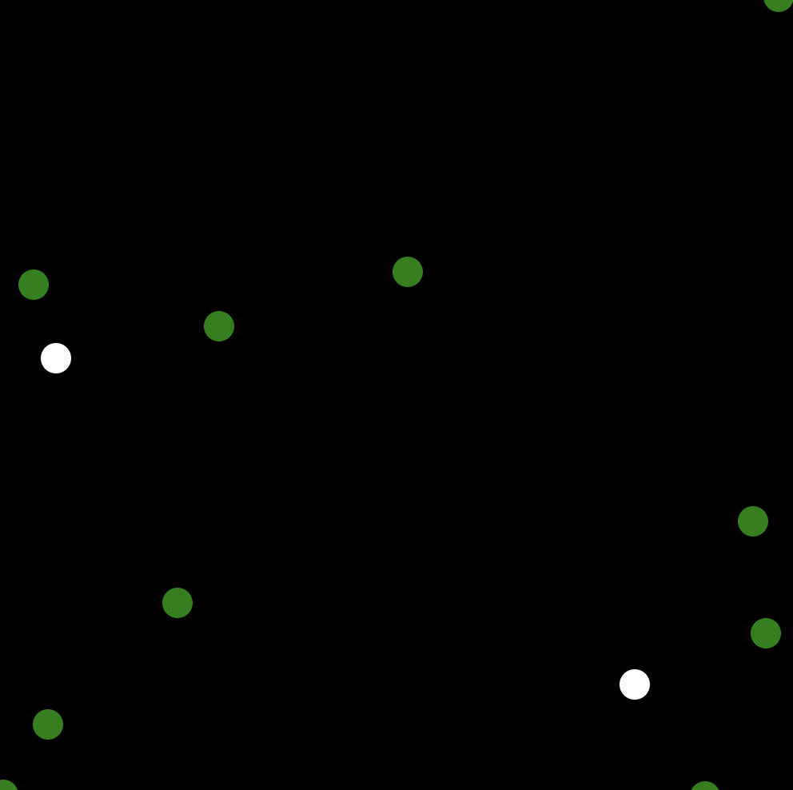
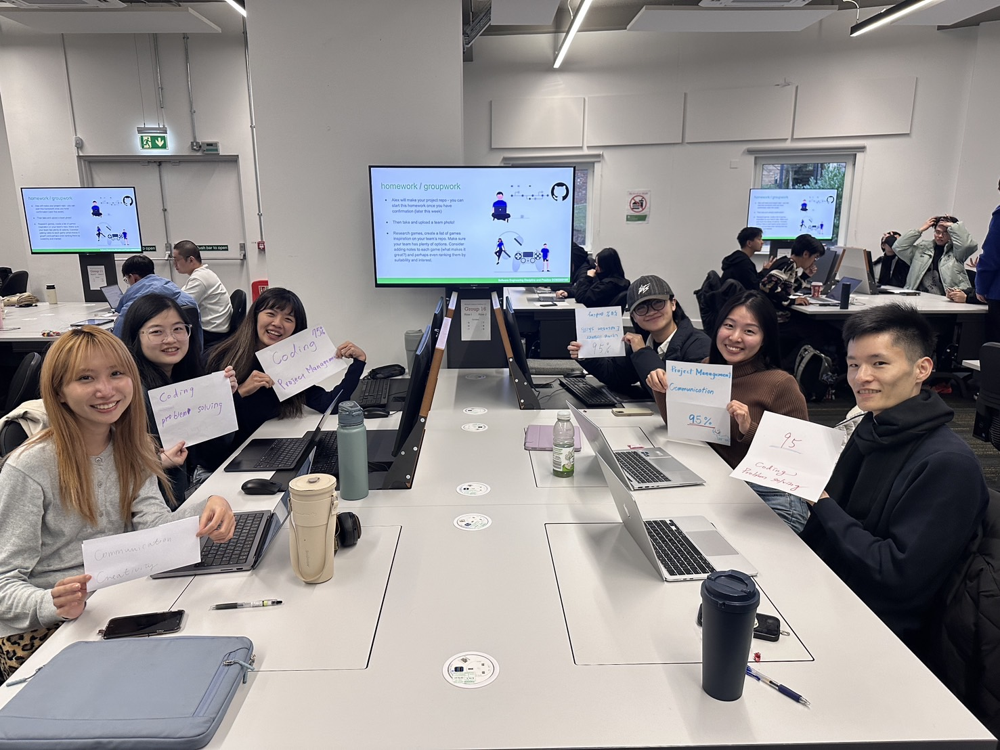
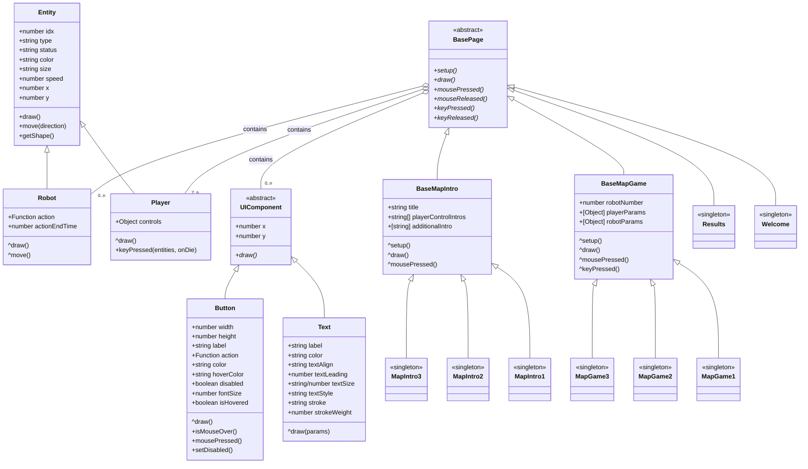
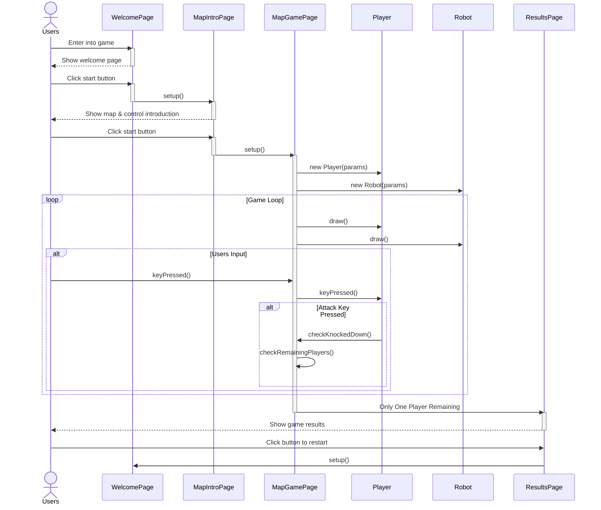

# 2025-group-16

2025 COMSM0166 group 16

## Our Game

Link to your game [PLAY HERE](https://uob-comsm0166.github.io/2025-group-16/)

Your game lives in the [/docs](/docs) folder, and is published using Github pages to the link above.

Include a demo video of your game here (you don't have to wait until the end, you can insert a work in progress video)

## Original Game List

| **Name**                   | **Introduction**                                                                                                                                                               | **Feasibility / Challenges**                                                                                                                                                          |
| -------------------------- | ------------------------------------------------------------------------------------------------------------------------------------------------------------------------------ | ------------------------------------------------------------------------------------------------------------------------------------------------------------------------------------- |
| **Unspottable**            | Multiple players join a party game where their goal is to blend in with robots and try to identify and beat other players among the robots.                                    | **Feasibility:** ★★★☆☆   - Algorithm for robot behavior.   - Convert 3D to 2D.   - Support simultaneous player controls.                                                     |
| **Taiko no Tatsujin**      | A rhythm music game where you choose your favorite song and score points by hitting notes with perfect timing as they reach the target spots.                                  | **Feasibility:** ★★★★☆   - Sync controls, music, and visuals.   - Convert music to beat points.                                                                                 |
| **Scream Chicken Jumpy**   | Control the chicken with your voice to move through obstacles and aim for the longest distance.                                                                                | **Feasibility:** ★★★☆☆   - Voice detection mechanism.   - Overlay game graphics on player video.   - Record and replay gameplay.                                             |
| **Super Bunny Man**        | A co-op physics platformer where players control a rabbit-costumed character. Team up locally or online to beat levels, find carrots, and race against the clock.              | **Feasibility:** ★☆☆☆☆   - 3D to 2D transition may affect smoothness.                                                                                                              |
| **PICO PARK**              | A cooperative puzzle game where players work together to solve unique challenges, compete in mini-games, or survive as long as possible to achieve high scores.                | **Feasibility:** ★★★★☆   - Puzzles for cooperative play.   - Handle latency, sync, and disconnections.   - Infinite map generation.                                          |
| **Pikachu Volleyball**     | A single-player or two-player game where characters move back and forth to catch the ball or jump to attack and block. Points are scored when the ball lands on the ground.    | **Feasibility:** ★☆☆☆☆   - Calculate bounce based on position and attributes.   - Design 2D animations for different scenarios.                                                 |
| **Gang Beasts**            | A hilarious multiplayer party game with chaotic gameplay. Modes include Melee (free-for-all fights), Gang (team battles), and Waves (co-op against AI enemies).                | **Feasibility:** ★☆☆☆☆   - Mechanics require time to master.   - Creating strong yet soft characters is challenging.                                                            |
| **King of Fighters**       | Up to 4 players can battle using a single keyboard. Modes include: versus, campaign, tournament, and War.                                                                      | **Feasibility:** ★☆☆☆☆   - Many characters with unique skills.   - Actions and items need to be combined.   - Complex keyboard controls.   - NPC enemies appear randomly. |
| **Ultimate Chicken Horse** | A party game where players build routes and place obstacles to challenge each other. Use simple movements to reach the goal while trying to block others.                      | **Feasibility:** ★☆☆☆☆   - Simultaneous controls for players.   - Complex scoring system.   - Issues with block and obstacle combinations.                                   |
| **King of Opera**          | A party game where characters continuously spin while idle. Players only need to control the forward button and try to knock others off by pushing them to fall from the edge. | **Feasibility:** ★☆☆☆☆   - 3D to 2D transition may affect smoothness.   - Sliding-back effect needed on hit.   - Precise reactions for consecutive collisions.               |
| **Ghost Invaders**         | A Space Invaders-inspired game featuring multiplayer controls for movement and shooting, with quick access to the menu and restart options.                                    | **Feasibility:** ★☆☆☆☆   - Excessive repetition.   - Difficulty imbalance affects player retention.                                                                             |

## Two Prototype Ideas GIFs

1. <a href="https://youtu.be/sJq6Dhigx1E"><b>Unspottable</b></a>
2. <a href="https://youtu.be/9nLy-XZOiaM"><b>Taiko no Tatsujin</b></a>

## Idea - Unspottable / Taiko no Tatsujin

<a href="https://store.steampowered.com/app/1243960/Unspottable/"><b>Unspottable</b></a>

Multiple players join a party game where they blend in with a crowd of robots while identifying and hunting down the other human players hidden among them, under various environmental rules.

Feasibility / Difficulty

1. Develop an algorithm to make robots behave like real players.
2. Convert 3D visual elements into a 2D style.
3. Implement simultaneous controls for multiple players (single-player mode is not supported).
4. Synchronize player actions and robot actions to ensure smooth gameplay.

Features

1. Simple controls: move, attack, run, and disturb.
2. Realistic robots involved.
3. Diverse maps with unique rules.
4. Customizable score system.

Twists / Stages

1. Basic Gameplay: 2-player simplest mode. Robots have no special behavior. Basic controls include: up, right, down, left, and hit.
2. More Maps: Add multiple maps with unique rules, such as Gym, Battlefield, Theater, and Nightclub.
3. More Controls: Introduce additional controls like running and disturbing, making the game more dynamic.
4. More Players: Support up to 4 local players.
5. Score System: Implement a scoring system where players set a target score to win.
6. Online Mode: Allow players to compete online with matchmaking or room creation.
7. Facial Recognition Control: Use facial recognition to control the direction of movement in the game, providing a more intuitive and fun way to interact with the game.

Simulation preview from p5js:

<a href="https://www.youtube.com/watch?v=perKCVKo-Mc"><b>Taiko no Tatsujin</b></a>

A rhythm music game where players choose their favorite song and score points by hitting notes with perfect timing as they reach the target spots on the screen. The better the timing, the higher the score.

Feasibility / Difficulty

1. Controls, music, and visuals must be perfectly synced for providing an engaging experience..
2. Transform songs into beat points for gameplay.

Features

1. Simple Controls: Only 2 buttons are needed.
2. Multiplayer & Score System: Support multiple players and track scores.
3. Multiple Songs & Levels: Offer a variety of songs with multiple level options of each.

Twists / Stages

1. Basic Gameplay: Playable with keyboard and only one song.
2. Start Screen: Add a start page before gameplay.
3. Song Selection: Allow players to choose from three or more songs.
4. Motion Detection: Add a motion-based gameplay mode.
5. Multiplayer: Add a two-player versus mode.
6. Custom Songs: Enable players to import music and auto-generate rhythm points.
7. Visual Recognition for Drumming Action: Integrate image recognition to track players' drumming actions in the air, increasing immersion and making the experience more interactive.

## Final Idea

To create an exciting and easy-to-play game, our goal is to develop Unspottable. The design of the characters and background maps will be our top priority. Additionally, we will be working on extra buttons and other visual indicators during this stage. At the same time, we will generate the first version of the p5.js code, maximizing our flexibility for future adjustments if needed.

For more advanced development, we aim to integrate face detection through the front-facing camera, allowing users to control their character using their face direction. This face detection-based control method will reduce the time users spend observing others, enhancing their overall experience.

## Your Group

- Group member 1, Yun-Fan Hsin, lt24003@bristol.ac.uk, hsinyunF
- Group member 2, Yu-Qi Lin, rk24876@bristol.ac.uk, chiderlin
- Group member 3, Wei Lin, tr24015@bristol.ac.uk, vivi2393142
- Group member 4, Digo Tu, ma24030@bristol.ac.uk, digotu
- Group member 5, Zih-Cing Lan, aw24252@bristol.ac.uk, ZihcingLan
- Group member 6, Pin-Ru Chen , tz24192@bristol.ac.uk, nezii0331

## Project Report

### Introduction

- 5% ~250 words
- Describe your game, what is based on, what makes it novel?

### Requirements

#### Stakeholder List

- User

- Developer

- Supervisor

- Competitor

#### Epics and User Stories

Please find all the tasks on our [Jira](https://vivi2393142-0702.atlassian.net/jira/software/projects/TG/boards/2/timeline), or check our documentations through the [link](https://vivi2393142-0702.atlassian.net/wiki/x/OoBm).

#### Reflection

- 15% ~750 words
- Use case diagrams, user stories. Early stages design. Ideation process. How did you decide as a team what to develop?
- Brief Reflection:
  Before taking the agile development class, we primarily focused on developing our own game, aiming to create a unique, user-friendly, and entertaining party game. While we had plenty of ideas, we lacked concrete plans for developing this game. However, after the class, our objectives were broken down into smaller, more manageable pieces, which makes our development goals much clearer.

  Through the introduction of stakeholders, we learned how to analyze both software users and competitors. In our project, stakeholders mainly include teachers, team members, and even fellow students in the same course, who might become potential users in the future. Identifying and defining these relationships early on allows our team to focus on the right audience and smoothly transition into the user stories and epics phase.

  When working with epics, having a clear goal is essential, but understanding our users is equally crucial for building an efficient development environment. These epics can be further divided into smaller, actionable tasks based on actual requirements. For instance, in our game, one of our key epics is to create an intuitive and accessible experience for all players, regardless of whether they are first-time users or experienced ones. This epic consists of several user stories, including tailored experiences for new players, returning players, and those who prefer to skip tutorials at the beginning of the game.

  Breaking down large objectives into smaller, well-defined tasks significantly streamlines the development process. Additionally, setting clear acceptance criteria ensures that our progress stays on track. If any issues arise, we can systematically analyze each step to identify where the problem occurred and make necessary adjustments.

### Design

- 15% ~750 words
- System architecture. Class diagrams, behavioural diagrams.

#### Class Diagram

#### Sequence Diagram

### Implementation

- 15% ~750 words

- Describe implementation of your game, in particular highlighting the three areas of challenge in developing your game.

### Evaluation

#### Two New Difficulty Levels

Our newly designed game architecture introduces additional difficulty levels, primarily based on map variations:

##### 1. Expanded Map Boundaries

More maps will be released in the coming weeks, featuring new boundaries that restrict player movement.

- We observed that players tend to move in a specific direction at the start of the game to identify their character.
- By introducing boundaries, this strategy will no longer be effective.
- Players will now have to navigate using all four directions to determine their identity while also being cautious not to cross the restricted areas.

##### 2. Randomized Machine Attacks

In another map, AI-controlled machines will launch random attacks, forcing players to stay vigilant.

- With robots actively attacking, players will no longer be able to distinguish between other players and robots by simply observing attack behavior.
- This change increases the game’s challenge and unpredictability, making gameplay more dynamic and engaging.

### Analysis: Qualitative and Quantitative Evaluation

In this analysis, we apply both **qualitative** and **quantitative** evaluation methods learned in class. The collected data provide clear insights from users, guiding us as developers to improve the game.

#### Qualitative Evaluation (via Think Aloud)

##### Feedback from Testers and Corresponding Solutions

###### 1. Introduction Page

- **Issue:** Unclear indication of how to close or skip the introduction page.
- **Issue:** Users do not know how to start the game from the homepage.
- **Overall Solution:** Redesign the introduction page with a clearer visual guide for key controls. Instead of the original textual instructions, we will use simple animations to demonstrate how to play the game.

###### 2. During the Game

- **Issue:** Players using the left-side keyboard struggled to find the correct attack key.
  - **Solution:** The new version of controller instructions aims to resolve this issue. Additionally, we have adjusted some key mappings to make controls more intuitive.
- **Issue:** The attack sound is too soft or not noticeable.
  - **Solution:** The sound design is being reconsidered, and an updated version will be released soon.
- **Issue:** Players did not realize that there is a delay time after each attack.
  - **Solution:** The new gameplay tutorial animation will explicitly show the attack delay mechanic.
- **Issue:** When robots are killed, the animations feel insufficient, reducing the gaming experience.
  - **Solution:** We are exploring enhanced death animations to improve player immersion.

---

#### Qualitative Evaluation (via Heuristic Evaluation)

##### Heuristic Evaluation

| Heuristic Principle            | Observations                         | Score (0-4) |
| ------------------------------ | ------------------------------------ | ----------- |
| User Control and Freedom       | Exit/undo options are unclear        | 2           |
| Recognition Rather Than Recall | Some instructions unclear or missing | 2           |

##### Feedback from Testers and Corresponding Solutions

###### 1. User Control and Freedom

- **Feedback:** Players found the exit and undo options unclear, making it difficult to restart or exit the game.
- **Solution:** We will add more intuitive options such as a **replay button** and a clearly labeled **exit key**, allowing players to restart or quit the game more easily.

###### 2. Recognition Rather Than Recall

- **Feedback:** Some instructions were unclear or missing, leading to confusion among players.
- **Solution:** We plan to redesign the instruction set to provide **clearer guidance**. This will be further detailed in the **Quantitative Evaluation** section, where we discuss usability improvements.

#### Quantitative Evaluation

##### Player Experience Analysis

| Metric          | Level I Average | Level II Average |
| --------------- | --------------- | ---------------- |
| Mental Demand   | 9.8             | 9.8              |
| Physical Demand | 10.2            | 9.8              |
| Temporal Demand | 11.9            | 12.1             |
| Performance     | 14.6            | 15.2             |
| Effort          | 11.3            | 11.8             |
| Frustration     | 3.7             | 5.1              |

##### Briefing

Quantitative Evaluation aims to provide user feedback through surveys conducted immediately after playing our game. Our data were collected from twelve users, each of whom played both Level I and Level II of the game.
• Level I is an easier version where players only need to attack each other.
• Level II introduces randomly attacking PC-controlled robots and adds boundaries to reduce the playing area, increasing the level of difficulty.

##### Findings

From the chart, we observe that Mental Demand and Physical Demand remain nearly the same across both levels. A slight increase can be seen in Temporal Demand, Performance, and Effort, indicating that players needed to invest more effort in handling the increased difficulty of Level II.

However, the most noticeable change is the increase in Frustration, suggesting that the harder gaming experience led to higher player frustration. Possible reasons include unclear map logic or the longer adaptation time required to understand the mechanics.

##### Conclusion

Overall, we aim to develop a wider variety of gaming experiences to enhance the level of challenge that players seek. Additionally, improving map introductions will be a key focus to ensure better player adaptation.

### Process

- 15% ~750 words

- Teamwork. How did you work together, what tools did you use. Did you have team roles? Reflection on how you worked together.

#### Github Workflow

Please find the link to check our [workflow](https://vivi2393142-0702.atlassian.net/wiki/spaces/TP/pages/8159293/GitHub+Workflow+Guideline).

#### Kanban, Meeting Minutes & Documentation

Our project management and documents are on Atlassian Jira. As the free plan doesn't support public sharing, please use the credentials below to access them.

<u>Access Links</u>

- [🔗 Jira Kanban Board](https://vivi2393142-0702.atlassian.net/jira/software/projects/TG/boards/2)
- [📄 Meeting Records & Documents](https://vivi2393142-0702.atlassian.net/wiki/spaces/TP/overview)

<u>Access Credentials</u>

- Email: team16_access@outlook.com
- Password: team16_password

Alternatively, if you prefer to use your own account, please request access from us.

### Conclusion

- 10% ~500 words

- Reflect on project as a whole. Lessons learned. Reflect on challenges. Future work.

### Contribution Statement

- Provide a table of everyone's contribution, which may be used to weight individual grades. We expect that the contribution will be split evenly across team-members in most cases. Let us know as soon as possible if there are any issues with teamwork as soon as they are apparent.

### Additional Marks

You can delete this section in your own repo, it's just here for information. in addition to the marks above, we will be marking you on the following two points:

- **Quality** of report writing, presentation, use of figures and visual material (5%)

  - Please write in a clear concise manner suitable for an interested layperson. Write as if this repo was publicly available.

- **Documentation** of code (5%)

  - Is your repo clearly organised?
  - Is code well commented throughout?
