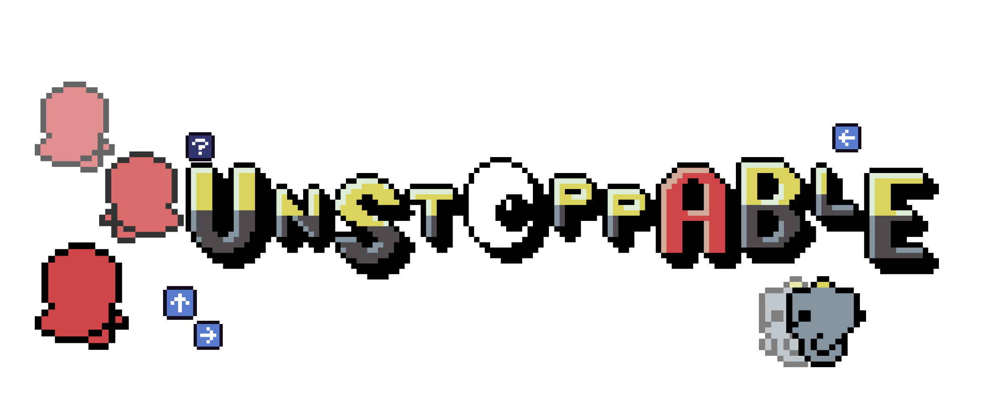
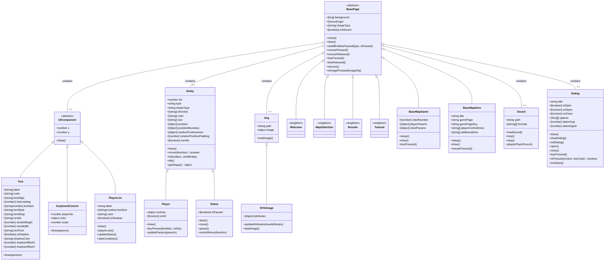
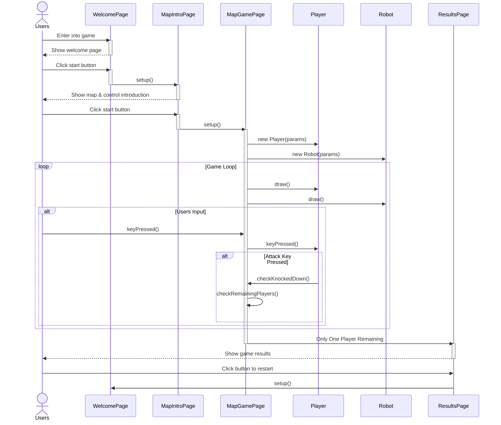
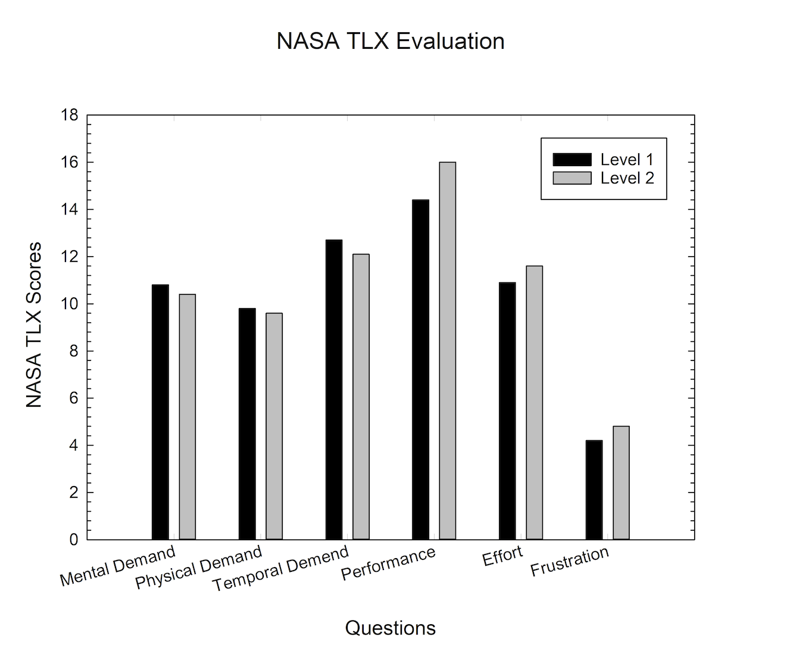

# 2025-group-16

2025 COMSM0166 group 16

## Contents

- [Our Game](#our-game)
- [Develop Team](#develop-team)
- [Project Report](#project-report)
  - [Introduction](#introduction)
  - [Requirements](#requirements)
  - [Design](#design)
  - [Implementation](#implementation)
  - [Evaluation: Qualitative and Quantitative Evaluation](#evaluation-qualitative-and-quantitative-evaluation)
  - [Sustainability](#-sustainability)
  - [Process](#process)
  - [Conclusion](#conclusion-1)
  - [Contribution Statement](#contribution-statement)
  - [Additional Marks](#additional-marks)

## Our Game

Link to your game [PLAY HERE](https://uob-comsm0166.github.io/2025-group-16/)

Your game lives in the [/docs](/docs) folder, and is published using Github pages to the link above.

## Video Demonstration

Find a game demonstration of the Unstoppable game below. This video is an overview of the gameplay mechanics and a sneak peek of our game.

## Develop Team

  
   
  <strong>Figure 1:</strong> Team Picture Week 1 with Team Role.

  <strong>Table 1:</strong> Development Team Members 
  <em>Team members with their student emails and GitHub usernames. From left to right.</em>

  <table>
    <thead>
      <tr>
        <th>No.</th>
        <th>Name</th>
        <th>Email</th>
        <th>GitHub Username</th>
      </tr>
    </thead>
    <tbody>
      <tr><td>1</td><td>Hsin-Yun Fan</td><td>lt24003@bristol.ac.uk</td><td>hsinyunF</td></tr>
      <tr><td>2</td><td>Yu-Qi Lin</td><td>rk24876@bristol.ac.uk</td><td>chiderlin</td></tr>
      <tr><td>3</td><td>Wei Lin</td><td>tr24015@bristol.ac.uk</td><td>vivi2393142</td></tr>
      <tr><td>4</td><td>Pin-Ru Chen</td><td>tz24192@bristol.ac.uk</td><td>nezii0331</td></tr>
      <tr><td>5</td><td>Zih-Cing Lan</td><td>aw24252@bristol.ac.uk</td><td>ZihcingLan</td></tr>
      <tr><td>6</td><td>Digo Tu</td><td>ma24030@bristol.ac.uk</td><td>digotu</td></tr>
    </tbody>
  </table>

## Project Report

### Introduction

Unspottable is a two-player party game where the ultimate goal is to find and eliminate your opponent. From Map 1 to Map 6, each stage offers a unique and progressively more challenging gameplay experience. 
Map 1 introduces the core mechanic: locate your opponent among NPCs and knock them out. 
Maps 2 to 6 build upon this foundation with diverse game rules, environments, and mechanics — all designed to make the game more dynamic, fun, and competitive.

---

### Requirements

  <strong>Table 2:</strong> Team Game Idea Overview 

| **Name**                   | **Introduction**                                                                                                                                                               | **Feasibility / Challenges**                                                                                                                                                          |
| -------------------------- | ------------------------------------------------------------------------------------------------------------------------------------------------------------------------------ | ------------------------------------------------------------------------------------------------------------------------------------------------------------------------------------- |
| **Unspottable**            | Multiple players join a party game where their goal is to blend in with robots and try to identify and beat other players among the robots.                                    | **Feasibility:** ★★★☆☆   - Algorithm for robot behavior.   - Convert 3D to 2D.   - Support simultaneous player controls.                                                     |
| **Taiko no Tatsujin**      | A rhythm music game where you choose your favorite song and score points by hitting notes with perfect timing as they reach the target spots.                                  | **Feasibility:** ★★★★☆   - Sync controls, music, and visuals.   - Convert music to beat points.                                                                                 |
| **Scream Chicken Jumpy**   | Control the chicken with your voice to move through obstacles and aim for the longest distance.                                                                                | **Feasibility:** ★★★☆☆   - Voice detection mechanism.   - Overlay game graphics on player video.   - Record and replay gameplay.                                             |
| **Super Bunny Man**        | A co-op physics platformer where players control a rabbit-costumed character. Team up locally or online to beat levels, find carrots, and race against the clock.              | **Feasibility:** ★☆☆☆☆   - 3D to 2D transition may affect smoothness.                                                                                                              |
| **PICO PARK**              | A cooperative puzzle game where players work together to solve unique challenges, compete in mini-games, or survive as long as possible to achieve high scores.                | **Feasibility:** ★★★★☆   - Puzzles for cooperative play.   - Handle latency, sync, and disconnections.   - Infinite map generation.                                          |
| **Pikachu Volleyball**     | A single-player or two-player game where characters move back and forth to catch the ball or jump to attack and block. Points are scored when the ball lands on the ground.    | **Feasibility:** ★☆☆☆☆   - Calculate bounce based on position and attributes.   - Design 2D animations for different scenarios.                                                 |
| **Gang Beasts**            | A hilarious multiplayer party game with chaotic gameplay. Modes include Melee (free-for-all fights), Gang (team battles), and Waves (co-op against AI enemies).                | **Feasibility:** ★☆☆☆☆   - Mechanics require time to master.   - Creating strong yet soft characters is challenging.                                                            |
| **King of Fighters**       | Up to 4 players can battle using a single keyboard. Modes include: versus, campaign, tournament, and War.                                                                      | **Feasibility:** ★☆☆☆☆   - Many characters with unique skills.   - Actions and items need to be combined.   - Complex keyboard controls.   - NPC enemies appear randomly. |
| **Ultimate Chicken Horse** | A party game where players build routes and place obstacles to challenge each other. Use simple movements to reach the goal while trying to block others.                      | **Feasibility:** ★☆☆☆☆   - Simultaneous controls for players.   - Complex scoring system.   - Issues with block and obstacle combinations.                                   |
| **King of Opera**          | A party game where characters continuously spin while idle. Players only need to control the forward button and try to knock others off by pushing them to fall from the edge. | **Feasibility:** ★☆☆☆☆   - 3D to 2D transition may affect smoothness.   - Sliding-back effect needed on hit.   - Precise reactions for consecutive collisions.               |
| **Ghost Invaders**         | A Space Invaders-inspired game featuring multiplayer controls for movement and shooting, with quick access to the menu and restart options.                                    | **Feasibility:** ★☆☆☆☆   - Excessive repetition.   - Difficulty imbalance affects player retention.                                                                             |

#### Two Prototype Ideas GIFs

  

<strong>Figure 2:</strong> Early prototype demonstration – basic player movement and interaction.

  
  
<strong>Figure 3:</strong> Advanced prototype demonstration – attacking, AI interaction and effects.

1. <a href="https://youtu.be/sJq6Dhigx1E"><b>Unspottable</b></a>
2. <a href="https://youtu.be/9nLy-XZOiaM"><b>Taiko no Tatsujin</b></a>

#### Idea - Unspottable / Taiko no Tatsujin

<a href="https://store.steampowered.com/app/1243960/Unspottable/"><b>Unspottable</b></a>

Multiple players join a party game where they blend in with a crowd of robots while identifying and hunting down the other human players hidden among them, under various environmental rules.

**Feasibility / Difficulty**

1. Develop an algorithm to make robots behave like real players.
2. Convert 3D visual elements into a 2D style.
3. Implement simultaneous controls for multiple players (single-player mode is not supported).
4. Synchronize player actions and robot actions to ensure smooth gameplay.

**Features**

1. Simple controls: move, attack, run, and disturb.
2. Realistic robots involved.
3. Diverse maps with unique rules.
4. Customizable score system.

**Twists / Stages**

1. Basic Gameplay: 2-player simplest mode. Robots have no special behavior. Basic controls include: up, right, down, left, and hit.
2. More Maps: Add multiple maps with unique rules, such as Gym, Battlefield, Theater, and Nightclub.
3. More Controls: Introduce additional controls like running and disturbing, making the game more dynamic.
4. More Players: Support up to 4 local players.
5. Score System: Implement a scoring system where players set a target score to win.
6. Online Mode: Allow players to compete online with matchmaking or room creation.
7. Facial Recognition Control: Use facial recognition to control the direction of movement in the game, providing a more intuitive and fun way to interact with the game.

  
   
  <strong>Figure 4:</strong> Simulation preview from p5.js showing early-stage interaction design.

<a href="https://www.youtube.com/watch?v=perKCVKo-Mc"><b>Taiko no Tatsujin</b></a>

A rhythm music game where players choose their favorite song and score points by hitting notes with perfect timing as they reach the target spots on the screen. The better the timing, the higher the score.

**Feasibility / Difficulty**

1. Controls, music, and visuals must be perfectly synced for providing an engaging experience..
2. Transform songs into beat points for gameplay.

**Features**

1. Simple Controls: Only 2 buttons are needed.
2. Multiplayer & Score System: Support multiple players and track scores.
3. Multiple Songs & Levels: Offer a variety of songs with multiple level options of each.

**Twists / Stages**

1. Basic Gameplay: Playable with keyboard and only one song.
2. Start Screen: Add a start page before gameplay.
3. Song Selection: Allow players to choose from three or more songs.
4. Motion Detection: Add a motion-based gameplay mode.
5. Multiplayer: Add a two-player versus mode.
6. Custom Songs: Enable players to import music and auto-generate rhythm points.
7. Visual Recognition for Drumming Action: Integrate image recognition to track players' drumming actions in the air, increasing immersion and making the experience more interactive.

#### Final Idea

To create an exciting and easy-to-play game, our goal is to develop Unspottable. The design of the characters and background maps will be our top priority. Additionally, we will be working on extra buttons and other visual indicators during this stage. At the same time, we will generate the first version of the p5.js code, maximizing our flexibility for future adjustments if needed.

#### Stakeholder List

- User

- Developer

- Supervisor

- Competitor

#### Epics and User Stories

Please find all the tasks on our [Jira](https://vivi2393142-0702.atlassian.net/jira/software/projects/TG/boards/2/timeline), or check our documentations through the [link](https://vivi2393142-0702.atlassian.net/wiki/x/OoBm).

#### Reflection

- Brief Reflection:
  Before taking the agile development class, we primarily focused on developing our own game, aiming to create a unique, user-friendly, and entertaining party game. While we had plenty of ideas, we lacked concrete plans for developing this game. However, after the class, our objectives were broken down into smaller, more manageable pieces, which makes our development goals much clearer.

  Through the introduction of stakeholders, we learned how to analyze both software users and competitors. In our project, stakeholders mainly include teachers, team members, and even fellow students in the same course, who might become potential users in the future. Identifying and defining these relationships early on allows our team to focus on the right audience and smoothly transition into the user stories and epics phase.

  When working with epics, having a clear goal is essential, but understanding our users is equally crucial for building an efficient development environment. These epics can be further divided into smaller, actionable tasks based on actual requirements. For instance, in our game, one of our key epics is to create an intuitive and accessible experience for all players, regardless of whether they are first-time users or experienced ones. This epic consists of several user stories, including tailored experiences for new players, returning players, and those who prefer to skip tutorials at the beginning of the game.

  Breaking down large objectives into smaller, well-defined tasks significantly streamlines the development process. Additionally, setting clear acceptance criteria ensures that our progress stays on track. If any issues arise, we can systematically analyze each step to identify where the problem occurred and make necessary adjustments.

---

### Design

#### Class Diagram

   
  <strong>Figure 5:</strong> Class diagram

#### Sequence Diagram

   
  <strong>Figure 6:</strong> Sequence Diagram

---

### Implementation

#### Three Technical Challenges

##### 1. Loading Too Many Assets (Images)

A game consists of many different graphical elements. Initially, when designing our JavaScript architecture, image loading posed a serious challenge. To address this, we implemented a module that allows color modifications through code, significantly reducing the number of images required. Additionally, we applied an SVG compression tool to enhance loading speed. These optimizations helped save both time and memory in the game’s development.

##### 2. Helping Users Understand the Game’s Rules

Although our game logic appears simple and intuitive, some users still struggled to find where to start or how to use the control panel. To improve this, we redesigned the keyboard instruction panel and placed it on the welcome page, ensuring visibility for both players. Furthermore, to enhance the overall gaming experience, we introduced an interactive tutorial before entering the game. This allows players to practice controlling their characters and attacking robots in a simulated environment. Lastly, since each of our maps has unique characteristics, we now display a map preview before entering the game to familiarize players with its special features.

##### 3. Designing Diverse Maps and Rules for Players

Originally, our game featured only one map where players were the sole attackers. This limited gameplay depth, making it less engaging for extended play sessions of five to ten minutes. To enhance replayability, we introduced new maps and gameplay mechanics. Expanding on the original map, we developed additional variations incorporating new features, such as PC-controlled robots that can attack. These improvements have made the game more dynamic and enjoyable.

#### Two New Difficulty Levels

Our newly designed game architecture introduces additional difficulty levels, primarily based on map variations:

##### 1. Expanded Map Boundaries

More maps will be released in the coming weeks, featuring new boundaries that restrict player movement.

- We observed that players tend to move in a specific direction at the start of the game to identify their character.
- By introducing boundaries, this strategy will no longer be effective.
- Players will now have to navigate using all four directions to determine their identity while also being cautious not to cross the restricted areas.

##### 2. Randomized Machine Attacks

In another map, AI-controlled machines will launch random attacks, forcing players to stay vigilant.

- With robots actively attacking, players will no longer be able to distinguish between other players and robots by simply observing attack behavior.
- This change increases the game’s challenge and unpredictability, making gameplay more dynamic and engaging.

---

### Evaluation: Qualitative and Quantitative Evaluation

In this analysis, we apply both **qualitative** and **quantitative** evaluation methods learned in class. The collected data provide clear insights from users, guiding us as developers to improve the game.

#### Qualitative Evaluation (via Think Aloud)

##### Feedback from Testers and Corresponding Solutions

###### 1. Introduction Page

- **Issue:** Unclear indication of how to close or skip the introduction page.
- **Issue:** Users do not know how to start the game from the homepage.
- **Overall Solution:** Redesign the introduction page with a clearer visual guide for key controls. Instead of the original textual instructions, we will use simple animations to demonstrate how to play the game.

###### 2. During the Game

- **Issue:** Players using the left-side keyboard struggled to find the correct attack key.
  - **Solution:** The new version of controller instructions aims to resolve this issue. Additionally, we have adjusted some key mappings to make controls more intuitive.
- **Issue:** The attack sound is too soft or not noticeable.
  - **Solution:** The sound design is being reconsidered, and an updated version will be released soon.
- **Issue:** Players did not realize that there is a delay time after each attack.
  - **Solution:** The new gameplay tutorial animation will explicitly show the attack delay mechanic.
- **Issue:** When robots are killed, the animations feel insufficient, reducing the gaming experience.
  - **Solution:** We are exploring enhanced death animations to improve player immersion.

---

#### Qualitative Evaluation (via Heuristic Evaluation)

##### Heuristic Evaluation

<strong>Table 3:</strong> Heuristic Evaluation Summary 
<em>Identified usability issues based on Nielsen’s heuristics.</em>

| Heuristic Principle            | Observations                         | Score (0-4) |
| ------------------------------ | ------------------------------------ | ----------- |
| User Control and Freedom       | Exit/undo options are unclear        | 2           |
| Recognition Rather Than Recall | Some instructions unclear or missing | 2           |

##### Feedback from Testers and Corresponding Solutions

###### 1. User Control and Freedom

- **Feedback:** Players found the exit and undo options unclear, making it difficult to restart or exit the game.
- **Solution:** We will add more intuitive options such as a **replay button** and a clearly labeled **exit key**, allowing players to restart or quit the game more easily.

###### 2. Recognition Rather Than Recall

- **Feedback:** Some instructions were unclear or missing, leading to confusion among players.
- **Solution:** We plan to redesign the instruction set to provide **clearer guidance**. This will be further detailed in the **Quantitative Evaluation** section, where we discuss usability improvements.

#### Quantitative Evaluation

##### Player Experience Analysis

<strong>Table 4:</strong> NASA TLX Average Scores of Level I and Level II 
<em>Player-reported cognitive load comparison between levels.</em>

| Metric          | Level I Average | Level II Average |
| --------------- | --------------- | ---------------- |
| Mental Demand   | 10.8            | 10.4             |
| Physical Demand | 9.8             | 9.6              |
| Temporal Demand | 12.7            | 12.1             |
| Performance     | 14.4            | 16               |
| Effort          | 10.9            | 11.6             |
| Frustration     | 4.2             | 4.8              |

  
   
  <strong>Figure 7:</strong> NASA TLX results showing user-perceived workload across Levels I and II.

##### Briefing

Quantitative Evaluation aims to provide user feedback through surveys conducted immediately after playing our game. Our data were collected from twelve users, each of whom played both Level I and Level II of the game.
• Level I is an easier version where players only need to attack each other.
• Level II introduces randomly attacking PC-controlled robots and adds boundaries to reduce the playing area, increasing the level of difficulty.

##### Findings

From the chart, we observe that Mental Demand and Physical Demand remain nearly the same across both levels. A slight decrease can be seen in Temporal Demand, which may suggest players became more accustomed to the game’s pacing. On the other hand, Performance and Effort scores increased, indicating that players needed to invest more energy and attention when tackling the added difficulty of Level II.

However, the most noticeable change is the increase in Frustration, suggesting that the harder gaming experience led to higher player frustration. Possible reasons include unclear map logic or the longer adaptation time required to understand the mechanics.

##### Conclusion

Overall, we aim to develop a wider variety of gaming experiences to enhance the level of challenge that players seek. Additionally, improving map introductions will be a key focus to ensure better player adaptation.

#### 🎮 Manual Testing Report

The following manual testing log records the major features of the game and their expected outcomes.
All tests were performed by the developer through real-time interaction using mouse and keyboard.
Each test includes the test action, the expected result, the actual behavior, and whether it passed.

##### Welcome Page

<strong>Table 5:</strong> Welcome page 

| Feature Description                                                  | Expected Behavior                                         | Actual Result  | Conclusion |
| -------------------------------------------------------------------- | --------------------------------------------------------- | -------------- | ---------- |
| Two characters enter the "Come Here" area → countdown starts (3-2-1) | Game starts after countdown                               | ✅ As expected | Passed     |
| If one player exits and re-enters during countdown                   | Countdown restarts                                        | ✅ As expected | Passed     |
| On game load, sound is muted                                         | No background music or sound initially                    | ✅ As expected | Passed     |
| Pressing any key activates sound                                     | Background music starts playing                           | ✅ As expected | Passed     |
| Clicking the speaker icon toggles mute                               | Sound is turned off again                                 | ✅ As expected | Passed     |
| First-time player sees "Start Tutorial?" popup                       | Tutorial prompt appears after first load                  | ✅ As expected | Passed     |
| Choosing "Yes" starts the tutorial                                   | Tutorial sequence begins                                  | ✅ As expected | Passed     |
| Choosing "No" skips tutorial and disables auto-popup next time       | Tutorial won't show again unless manually triggered       | ✅ As expected | Passed     |
| Clicking the "?" icon shows tutorial prompt again                    | Tutorial dialog appears again                             | ✅ As expected | Passed     |
| In tutorial, standing on yellow zone → area moves and score +1       | Area shifts and score increases                           | ✅ As expected | Passed     |
| After completing tutorial, pressing any key returns to main screen   | Welcome page is shown again                               | ✅ As expected | Passed     |
| Entering "Come Here" zone updates player status indicator to "OK"    | Status text below character shows “OK”                    | ✅ As expected | Passed     |
| After countdown, a game mode selection window appears                | Players choose score goal before entering the actual game | ✅ As expected | Passed     |

##### Charactor Control

<strong>Table 6:</strong> Charactor control 

| Feature              | Action Description                      | Expected Result              | Actual Result      | Conclusion |
| -------------------- | --------------------------------------- | ---------------------------- | ------------------ | ---------- |
| Arrow Key Movement   | Use arrow keys to move the character    | Character moves in direction | ✅ Moves correctly | Passed     |
| Valid Key Response   | Press correct key in game ("Q" and "?") | Character performs action    | ✅ Correct action  | Passed     |
| Invalid Key Handling | Press invalid key (e.g., spacebar)      | No effect                    | ✅ No error        | Passed     |

##### Map and Game Flow

<strong>Table 7:</strong> Map and game flow 

| Feature Description                                              | Expected Behavior                             | Actual Result  | Conclusion |
| ---------------------------------------------------------------- | --------------------------------------------- | -------------- | ---------- |
| Selecting map using directional keys enlarges selected map       | Selected map is visually highlighted          | ✅ As expected | Passed     |
| Pressing "Q", "?" or "Enter" loads corresponding map             | Game map is entered                           | ✅ As expected | Passed     |
| Entering map shows game intro screen                             | Game instructions displayed                   | ✅ As expected | Passed     |
| Robots move randomly                                             | Robots continuously move in random directions | ✅ As expected | Passed     |
| Player attacks robot → robot flickers and disappears             | Robot vanishes after being hit                | ✅ As expected | Passed     |
| During attack, UI shows cooldown (blacked out button)            | Attack button grayed out, shows countdown     | ✅ As expected | Passed     |
| Player cannot act during cooldown (move or attack)               | Player is locked out until cooldown ends      | ✅ As expected | Passed     |
| Player attacks another player → target flickers, winner is shown | Target flashes and win screen appears         | ✅ As expected | Passed     |
| Attacked player becomes "K.O."                                   | Player marked with "K.O." status visually     | ✅ As expected | Passed     |
| **Grass Map** – Robots randomly attack players                   | Robots can attack player                      | ✅ As expected | Passed     |
| **Jail Map** – Player touching wall dies                         | Colliding with wall results in instant death  | ✅ As expected | Passed     |
| **Dance Map** – Random direction keys appear on timer            | Keys appear periodically at top               | ✅ As expected | Passed     |
| **Dance Map** – Keys move from right to left                     | Keys slide toward center line                 | ✅ As expected | Passed     |
| **Dance Map** – When key reaches white line, all robots move     | Robots execute synchronized action            | ✅ As expected | Passed     |
| **Fighting Map** – Countdown 3-2-1 appears periodically          | Countdown shows on screen before action       | ✅ As expected | Passed     |
| **Fighting Map** – Robots act after countdown ends               | Robots attack together after countdown        | ✅ As expected | Passed     |
| **Transfer Point Map** – Player steps on portal → portal spins   | Portal starts rotating                        | ✅ As expected | Passed     |
| **Transfer Point Map** – Player triggers robot character switch  | Two robots swap characters                    | ✅ As expected | Passed     |

##### Scoring and Feedback

<strong>Table 8:</strong> Scoring and feedback 

| Feature Description                                           | Expected Behavior                                     | Actual Result  | Conclusion |
| ------------------------------------------------------------- | ----------------------------------------------------- | -------------- | ---------- |
| Winning player performs victory waving animation              | Winner waves on screen                                | ✅ As expected | Passed     |
| Losing player performs kneeling animation                     | Loser kneels or collapses visually                    | ✅ As expected | Passed     |
| Score increases with animation                                | Score counter animates upwards                        | ✅ As expected | Passed     |
| Pressing any key mid-game returns to map selection            | Game exits to map selection screen                    | ✅ As expected | Passed     |
| If game round ends, pressing any key returns to welcome page  | Game resets to welcome screen                         | ✅ As expected | Passed     |
| Final result: winning character jumps with confetti animation | Player jumps and colorful confetti falls from the top | ✅ As expected | Passed     |

---

### 🌱 Sustainability

#### 1. Sustainability Impact Analysis

- **Overview Table (Base on the Sustainability Awareness Framework)**

<strong>Table 9:</strong> Overview table 

| **Dimension**     | **Guiding Question**                                        | **Impact / Insight**                                                                                             |
| ----------------- | ----------------------------------------------------------- | ---------------------------------------------------------------------------------------------------------------- |
| **Individual**    | How can it affect physical, mental, or emotional health?    | Improves mental health by reducing social anxiety through fun interaction.                                       |
|                   | How can it affect competencies?                             | Enhances communication, observation, and social interaction skills.                                              |
|                   | How can it make a person feel more or less exposed to harm? | Offers a safe, inclusive environment that minimizes discomfort.                                                  |
| **Technical**     | What are likely vulnerabilities of the system?              | Outdated dependencies, lack of logging.   _Mitigation:_ Regular updates, security audits, monitoring.         |
|                   | How might OS/runtime changes affect it?                     | Requires cross-platform testing and adaptation for different environments (Windows/macOS/Linux).                 |
| **Economic**      | How does it affect customer relationships?                  | Enjoyable gameplay may lead to more players, enabling ad-based revenue opportunities.                            |
|                   | How does it impact finances?                                | Digital format lowers manufacturing costs and increases long-term value.                                         |
|                   | How does it affect the supply chain?                        | No physical production required → reduces material use and labor costs.                                          |
| **Environmental** | How does it affect material/resource consumption?           | Replaces traditional board games → reduces paper/plastic usage.                                                  |
|                   | What about waste and emissions?                             | Digital transition reduces manufacturing waste and associated emissions.                                         |
|                   | What about energy use?                                      | Saves energy from manufacturing; increases digital energy use.   _Mitigation:_ Use OLED-friendly dark themes. |
|                   | How can it impact nature?                                   | Frees up land and resources otherwise used for production → benefits natural habitats.                           |
| **Social**        | How does it affect group belonging?                         | Strengthens community bonds through cooperative gameplay.                                                        |
|                   | How does it affect perception of others?                    | Encourages observation and empathy, building stronger interpersonal connections.                                 |
|                   | How does it affect treatment of others?                     | Encourages knowledge-sharing; experienced players support beginners.                                             |
|                   | How does it affect social behaviors?                        | Promotes communication, teamwork, and collaborative problem-solving.                                             |

   

- **Chains of Effects - Sustainability Dimensions**

<strong>Table 10:</strong> Chains of Effects - Sustainability Dimensions 

| **Dimension / Topic**                     | **Chains of Effects**                                                                                                                                                                                                                                                                          |
| ----------------------------------------- | ---------------------------------------------------------------------------------------------------------------------------------------------------------------------------------------------------------------------------------------------------------------------------------------------- |
| **Individual: Health**                    | play in party → easy to make friends → reduce social anxiety → establish confidence   play in party → learn emotional management → develop social adaptability → reduce isolation and mental disease   play with others → increase perceptiveness → easier to make friends in the future |
| **Environmental: Material & Resources**   | more on digital game → less board games → less consumption on making board games                                                                                                                                                                                                               |
| **Environmental: Energy**                 | more on digital game → less board games → less energy consumption on making board games   more on digital game → more energy consumption to run computers & servers                                                                                                                         |
| **Technical: Maintainability**            | structured code → easier for developer to maintain and upgrade system                                                                                                                                                                                                                          |
| **Social: Sense of Community**            | require 2 to play → play game together → build connection → players feel a sense of belonging to community                                                                                                                                                                                     |
| **Social: Participation & Communication** | require 2 to play → experienced one may teach the other player → increase communication between players                                                                                                                                                                                        |
| **Economic: Customer Relationship**       | people enjoy playing → spend more time on the game → game provider adds advertisements → company gains benefit → company improves features → players enjoy more → more users...                                                                                                                |

   

#### 2. Green Software Foundation Patterns – Game Integration

<strong>Table 11:</strong> Green Software Foundation Patterns – Game Integration 

| Plan to Add to Game             | Relevant Pattern                    | Link                                                                                     | Task Description                                                          | Jira                                                                |
| ------------------------------- | ----------------------------------- | ---------------------------------------------------------------------------------------- | ------------------------------------------------------------------------- | ------------------------------------------------------------------- |
| Minify web assets               | Minify Web Assets                   | [Pattern](https://patterns.greensoftware.foundation/catalog/web/minify-web-assets)       | Reduce size of SVG images in the game website to lower energy consumption | [DONE-TG-147](https://vivi2393142-0702.atlassian.net/browse/TG-147) |
| Replace GIFs with SVG animation | Deprecate GIFs for animated content | [Pattern](https://patterns.greensoftware.foundation/catalog/web/deprecate-gifs)          | Use SVG animation instead of GIF for the loading animation                | [DONE-TG-74](https://vivi2393142-0702.atlassian.net/browse/TG-74)   |
| Remove redundant assets         | Keep Request Counts Low             | [Pattern](https://patterns.greensoftware.foundation/catalog/web/keep-request-counts-low) | Delete unnecessary SVG files to reduce total number of HTTP requests      | [DONE-TG-149](https://vivi2393142-0702.atlassian.net/browse/TG-149) |

 

#### 3. Sustainability Requirements -> User stories

<strong>Table 12:</strong> Sustainability Requirements -> User stories 

| **Epic**                                          | **Story**                                                                                                                                                                                           | **Acceptance Criteria**                                                                                                                                                                                                                                                                                                                  | **Jira**                                                                                  |
| ------------------------------------------------- | --------------------------------------------------------------------------------------------------------------------------------------------------------------------------------------------------- | ---------------------------------------------------------------------------------------------------------------------------------------------------------------------------------------------------------------------------------------------------------------------------------------------------------------------------------------- | ----------------------------------------------------------------------------------------- |
| **Improve Website Performance**                   | - `As a` player   - `I want` to play lighter game   - `so that` I can use less energy when running this game   _(Environment: Energy)_                                                     | - `Given` the website contains images in the codebase   - `When` the website is loaded   - `Then` the total file size of all images should be reduced by at least 30% compared to the original size                                                                                                                                | [TG-147: Minify images file size](https://vivi2393142-0702.atlassian.net/browse/TG-147)   |
|                                                   | - `As a` developer   - `I want` to make this game more secure   - `so that` players' data and gameplay experience are protected from potential security threats.   _(Technical: Security)_ | - `Given` the game project is set up to compile source code before deployment, ensuring that only the compiled version is accessible   - `When` the game is built and deployed to a public environment,   - `Then` the original source code remains hidden, and only the necessary executable files or compiled assets are exposed | [TG-148: Bundle code & hide source](https://vivi2393142-0702.atlassian.net/browse/TG-148) |
| **Improve first-time user onboarding experience** | - `As a` player   - `I want` to understand how to play as quicker as possible   - `so that` I can enjoy the game sooner.   _(Individual: Health)_                                          | - `Given` instruction for players   - `When` users play the game at the first time   - `Then` an initial guide is provided for users to practice. They are required to finish all the practices to get the thorough understanding of the controls and gameplay.                                                                    | [TG-41: Add a guided tutorial](https://vivi2393142-0702.atlassian.net/browse/TG-41)       |

More Info in [Jira](https://vivi2393142-0702.atlassian.net/wiki/spaces/TP/pages/edit-v2/25919494?).

### Process

Our team collaborated through a structured software development workflow:

#### Code Collaboration

All code is hosted on GitHub. We use Pull Requests (PRs) for every code change — direct push to the main branch is not allowed. Check our [workflow](https://vivi2393142-0702.atlassian.net/wiki/spaces/TP/pages/8159293/GitHub+Workflow+Guideline) for more details.

#### Project Management (Kanban & Sprints)

We manage tasks on Jira, using the Epic/User Story structure. We organize our work in bi-weekly sprints:

1. At the end of each sprint, we hold a Sprint Review to check progress, demonstrate features, and discuss blockers.

2. Then we conduct Sprint Planning to decide what tasks move forward in the next sprint.

3. Unfinished tasks remain in the Backlog for future prioritization.

#### Documentation & Coding Standards

To help developers contribute smoothly:

- We maintain a detailed [Developer README](/docs/README.md) with setup instructions, project structure, and coding guidelines.

- We enforce code style using `ESLint` and `Prettier`.

- We unify editor settings using `EditorConfig` and shared `.vscode` configurations.

#### Access to Jira Board & Documents

Since Jira's free plan doesn’t allow public sharing, we provide a shared account for reviewers:

<u>Access Links</u>

- [🔗 Jira Kanban Board](https://vivi2393142-0702.atlassian.net/jira/software/projects/TG/boards/2)
- [📄 Meeting Records & Documents](https://vivi2393142-0702.atlassian.net/wiki/spaces/TP/overview)

<u>Access Credentials</u>

- Email: team16_access@outlook.com
- Password: team16_password

Alternatively, request access using your own account.

---

### Conclusion

- 10% ~500 words

- Reflect on project as a whole. Lessons learned. Reflect on challenges. Future work.

---

### Future Possibility

For more advanced development, we aim to integrate face detection through the front-facing camera, allowing users to control their character using their face direction. This face detection-based control method will reduce the time users spend observing others, enhancing their overall experience.

---

### Contribution Statement

<strong>Table 13:</strong> Contribution table 

| Name                       | Role                       | Key Contributions                                                                                                                                                    |
| -------------------------- | -------------------------- | -------------------------------------------------------------------------------------------------------------------------------------------------------------------- |
| **Vivi (Wei Lin)**         | 🧩 Project Lead            | - Led overall workflow and task distribution - Designed system architecture and codebase - Managed team communication and progress using Jira                  |
| **Negi (Chen Pin Ru)**     | 🎨 UX & Visual Designer    | - Designed guidance/navigation screens and map visuals - Built the full navigation system - Directed intro video production (script, storyboard, editing)      |
| **Chi (Yu-Qi Lin)**        | 🧪 Game Developer & Tester | - Built the Welcome Page - Developed Map 4 and designed layout for Map 5 - Conducted full gameplay testing and visual polish                                   |
| **Cynthia (Hsin-Yun Fan)** | 🖼️ Visual Designer         | - Designed game scene visuals - Led development of Map 5                                                                                                          |
| **Digo (Hsing-Min Tu)**    | 📚 Documentation Manager   | - Collected data and maintained documentation - Managed GitHub README - Analyzed user feedback - Prototyped Map 3 & developed Game 6 logic                  |
| **Susan (Zih-Cing Lan)**   | 🎬 Content & Demo Designer | - Designed Map 6 and its music - Created intro content for Maps 2–6 & Welcome Page - Managed demo process and co-edited the final video with subtitles & sound |

---
