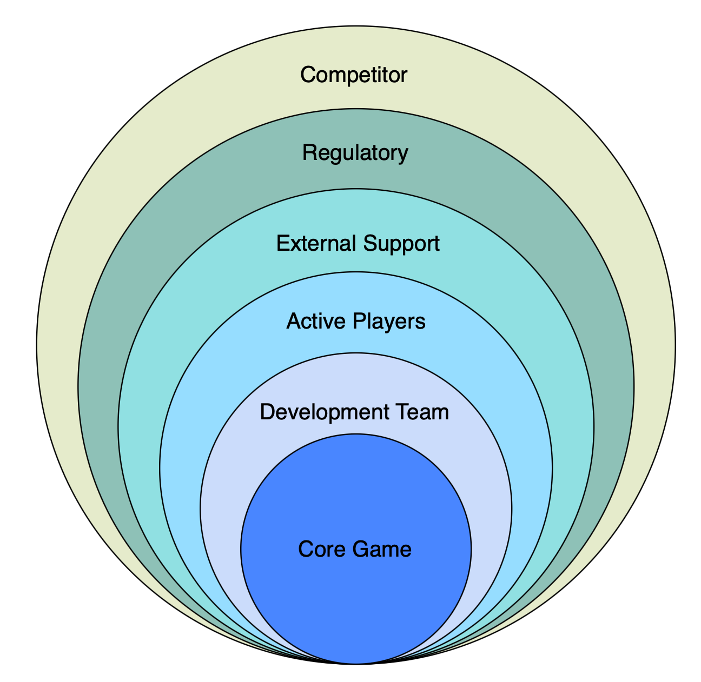
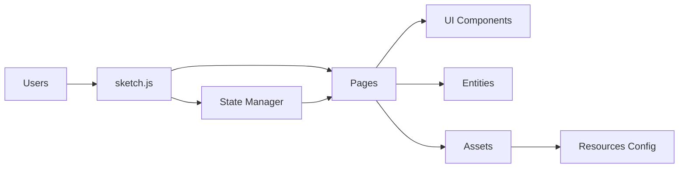
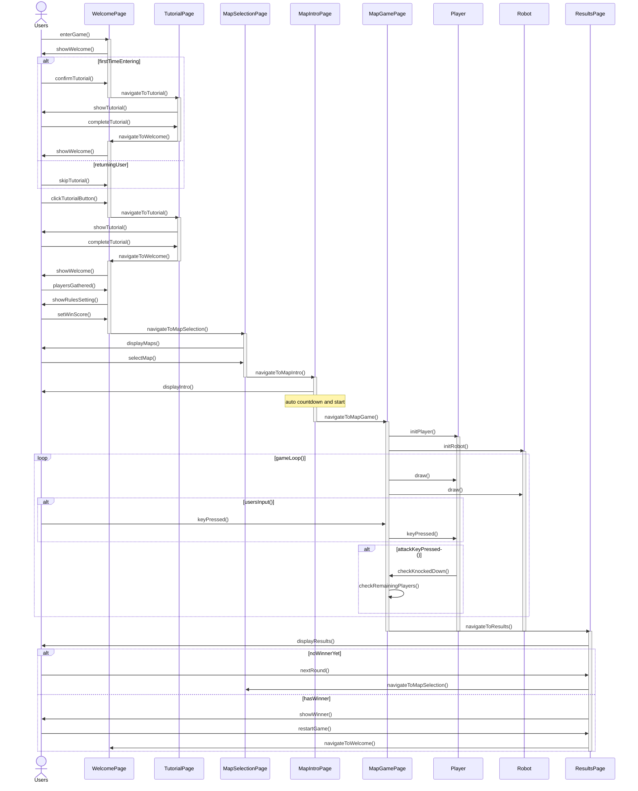
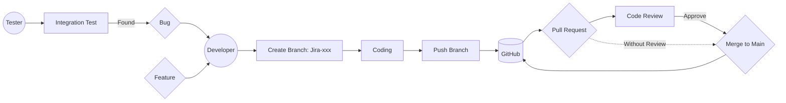
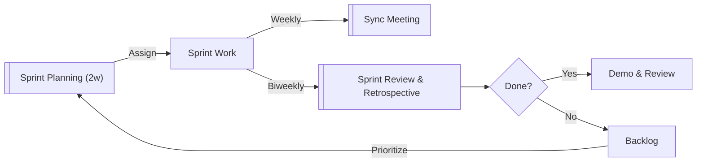
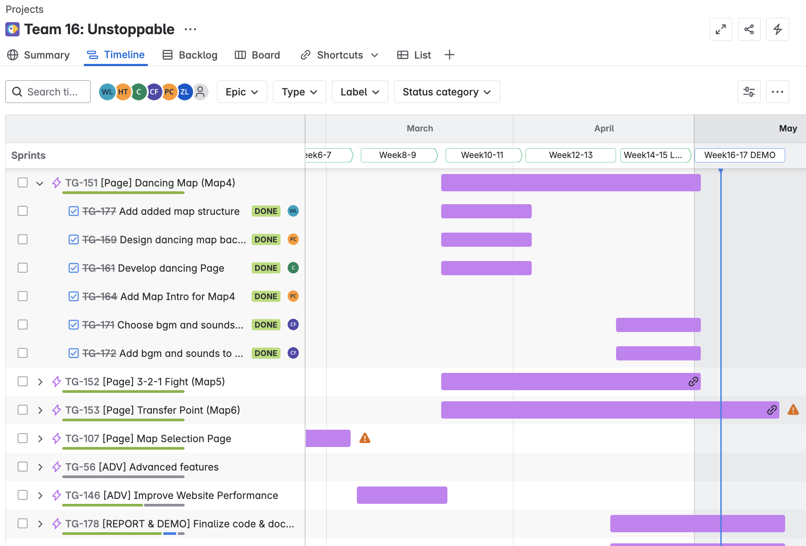
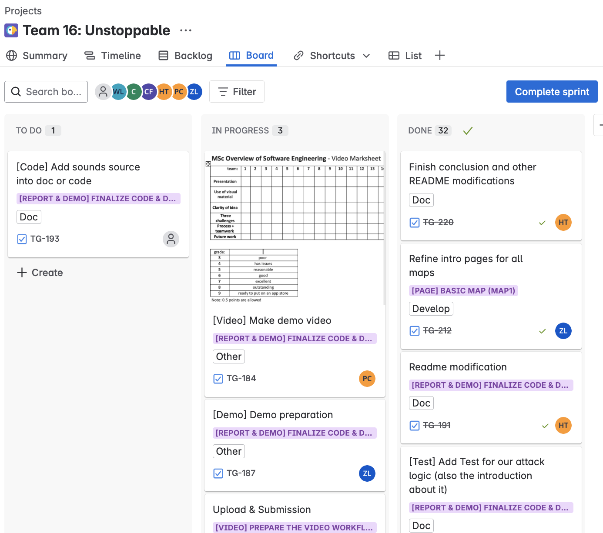
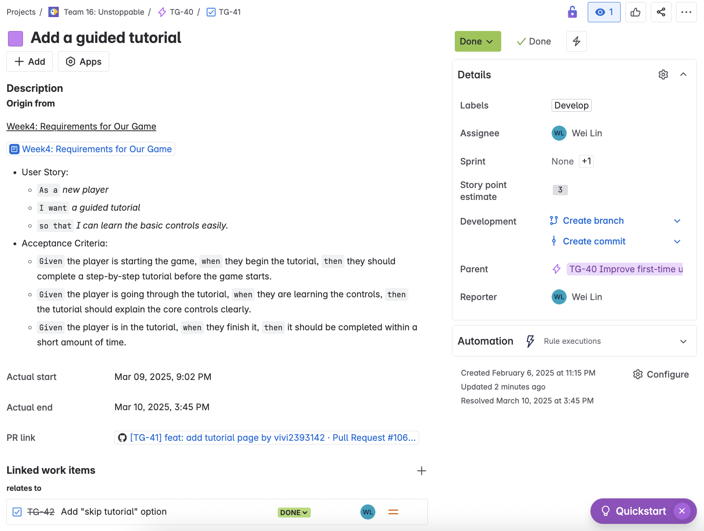

# 2025-group-16

  
    
  
    
  

## Contents

1. [Our Game](#1-our-game)
2. [Develop Team](#2-develop-team)
3. [Project Report](#3-project-report)
   - [3.1 Introduction](#31-introduction)
     - [3.1.1 Map Overviews](#311-map-overviews)
   - [3.2 Requirements](#32-requirements)
     - [3.2.1 Team Game Idea Overviews](#321-team-game-idea-overviews)
     - [3.2.2 Stakeholder List](#322-stakeholder-list)
     - [3.2.3 Epics and User Stories](#323-epics-and-user-stories)
     - [3.2.4 Reflection](#324-reflection)
   - [3.3 Design](#33-design)
   - [3.4 Implementation](#34-implementation)
     - [3.4.1 Three Technical Challenges](#341-three-technical-challenges)
     - [3.4.2 Two New Difficulty Levels](#342-two-new-difficulty-levels)
   - [3.5 Evaluation](#35-evaluation)
     - [3.5.1 Qualitative Evaluation](#351-qualitative-evaluation)
       - [3.5.1.1 Think Aloud](#3511-think-aloud)
       - [3.5.1.2 Heuristic Evaluation](#3512-heuristic-evaluation)
     - [3.5.2 Quantitative Evaluation](#352-quantitative-evaluation)
     - [3.5.3 Tests](#353-tests)
   - [3.6 Sustainability](#36-sustainability)
   - [3.7 Process](#37-process)
     - [3.7.1 Code Collaboration & Roles](#371-code-collaboration--roles)
     - [3.7.2 Project Management (Kanban & Sprints)](#372-project-management-kanban--sprints)
     - [3.7.3 Communication](#373-communication)
     - [3.7.4 Documentation & Coding Standards](#374-documentation--coding-standards)
     - [3.7.5 Access to Jira Board & Documents](#375-access-to-jira-board--documents)
   - [3.8 Conclusion](#38-conclusion)
   - [3.9 Contribution Statement](#39-contribution-statement)

## 1. Our Game

### Game

Link to our game [PLAY HERE](https://uob-comsm0166.github.io/2025-group-16/)

Our game lives in the [/docs](/docs) folder, and is published using Github pages to the link above.

### Video Demonstration

Find a game demonstration of the Unstoppable game below. This video is an overview of the gameplay mechanics and a sneak peek of our game.

## 2. Development Team

  
   
  <strong>Figure 1:</strong> Team Picture Week 1 with Team Role.

  <strong>Table 1:</strong> Development Team Members 
  <em>Team members with their student emails and GitHub usernames. From left to right.</em>

  <table>
    <thead>
      <tr>
        <th>No.</th>
        <th>Name</th>
        <th>Email</th>
        <th>GitHub Username</th>
      </tr>
    </thead>
    <tbody>
      <tr><td>1</td><td>Hsin-Yun Fan</td><td>lt24003@bristol.ac.uk</td><td>hsinyunF</td></tr>
      <tr><td>2</td><td>Yu-Qi Lin</td><td>rk24876@bristol.ac.uk</td><td>chiderlin</td></tr>
      <tr><td>3</td><td>Wei Lin</td><td>tr24015@bristol.ac.uk</td><td>vivi2393142</td></tr>
      <tr><td>4</td><td>Pin-Ru Chen</td><td>tz24192@bristol.ac.uk</td><td>nezii0331</td></tr>
      <tr><td>5</td><td>Zih-Cing Lan</td><td>aw24252@bristol.ac.uk</td><td>ZihcingLan</td></tr>
      <tr><td>6</td><td>Digo Tu</td><td>ma24030@bristol.ac.uk</td><td>digotu</td></tr>
    </tbody>
  </table>

## 3. Project Report

### 3.1 Introduction

**Unstoppable** is a two-player party game where the ultimate goal is to find and eliminate your opponent.
From **Map 1** to **Map 6**, each stage offers a unique and progressively more challenging gameplay experience:

- **Map 1** introduces the core mechanic: locate your opponent among NPCs and knock them out.
- **Maps 2 to 6** build upon this foundation with diverse game rules, environments, and mechanics — all designed to make the game more dynamic, fun, and competitive.

---

#### 3.1.1 Map Overviews

To provide players with a deeper understanding of the game, here is an overview of each unique map:

  <strong>Table 2:</strong> Map Overviews 

| **Map Name**                                                            | **Icon** | **Description**                                                                                                                                   |
| ----------------------------------------------------------------------- | -------- | ------------------------------------------------------------------------------------------------------------------------------------------------- |
| **Map 1 – Only players can punch**                                      | 🗺️       | This is the most basic map, with no attacking behavior from robots or environmental hazards — ideal for learning the core mechanics.              |
| **Map 2 – Robots can punch players too**                                | 🤖       | This map introduces hostile NPCs, increasing the difficulty by forcing players to dodge both robots and opponents.                                |
| **Map 3 – Touching the map boundaries results in instant death**        | ⚡       | An electrified border surrounds the arena, limiting player movement and punishing those who step outside the safe zone.                           |
| **Map 4 – All robots follow on-screen dance commands**                  | 🎵       | Players must mimic the synchronized movements of the crowd to avoid detection, while carefully watching for suspicious actions from the opponent. |
| **Map 5 – A countdown triggers a synchronized punch**                   | ⏳       | All characters must punch on the final count. Players can blend in by timing their punch correctly or wait at the edge and strike strategically.  |
| **Map 6 – A magic circle randomly teleports players and nearby robots** | 🔄       | Stepping into the magic circle triggers sudden teleportation, creating visual confusion and making it harder to track the real player.            |

---

### 3.2 Requirements

#### 3.2.1 Team Game Idea Overviews

  
Team Game Idea Overview

  <strong>Table 3:</strong> Team Game Idea Overview 

 

| **Name**                   | **Introduction**                                                                                                                                                               | **Feasibility / Challenges**                                                                                                                                                          |
| -------------------------- | ------------------------------------------------------------------------------------------------------------------------------------------------------------------------------ | ------------------------------------------------------------------------------------------------------------------------------------------------------------------------------------- |
| **Unspottable**            | Multiple players join a party game where their goal is to blend in with robots and try to identify and beat other players among the robots.                                    | **Feasibility:** ★★★☆☆   - Algorithm for robot behavior.   - Convert 3D to 2D.   - Support simultaneous player controls.                                                     |
| **Taiko no Tatsujin**      | A rhythm music game where you choose your favorite song and score points by hitting notes with perfect timing as they reach the target spots.                                  | **Feasibility:** ★★★★☆   - Sync controls, music, and visuals.   - Convert music to beat points.                                                                                 |
| **Scream Chicken Jumpy**   | Control the chicken with your voice to move through obstacles and aim for the longest distance.                                                                                | **Feasibility:** ★★★☆☆   - Voice detection mechanism.   - Overlay game graphics on player video.   - Record and replay gameplay.                                             |
| **Super Bunny Man**        | A co-op physics platformer where players control a rabbit-costumed character. Team up locally or online to beat levels, find carrots, and race against the clock.              | **Feasibility:** ★☆☆☆☆   - 3D to 2D transition may affect smoothness.                                                                                                              |
| **PICO PARK**              | A cooperative puzzle game where players work together to solve unique challenges, compete in mini-games, or survive as long as possible to achieve high scores.                | **Feasibility:** ★★★★☆   - Puzzles for cooperative play.   - Handle latency, sync, and disconnections.   - Infinite map generation.                                          |
| **Pikachu Volleyball**     | A single-player or two-player game where characters move back and forth to catch the ball or jump to attack and block. Points are scored when the ball lands on the ground.    | **Feasibility:** ★☆☆☆☆   - Calculate bounce based on position and attributes.   - Design 2D animations for different scenarios.                                                 |
| **Gang Beasts**            | A hilarious multiplayer party game with chaotic gameplay. Modes include Melee (free-for-all fights), Gang (team battles), and Waves (co-op against AI enemies).                | **Feasibility:** ★☆☆☆☆   - Mechanics require time to master.   - Creating strong yet soft characters is challenging.                                                            |
| **King of Fighters**       | Up to 4 players can battle using a single keyboard. Modes include: versus, campaign, tournament, and War.                                                                      | **Feasibility:** ★☆☆☆☆   - Many characters with unique skills.   - Actions and items need to be combined.   - Complex keyboard controls.   - NPC enemies appear randomly. |
| **Ultimate Chicken Horse** | A party game where players build routes and place obstacles to challenge each other. Use simple movements to reach the goal while trying to block others.                      | **Feasibility:** ★☆☆☆☆   - Simultaneous controls for players.   - Complex scoring system.   - Issues with block and obstacle combinations.                                   |
| **King of Opera**          | A party game where characters continuously spin while idle. Players only need to control the forward button and try to knock others off by pushing them to fall from the edge. | **Feasibility:** ★☆☆☆☆   - 3D to 2D transition may affect smoothness.   - Sliding-back effect needed on hit.   - Precise reactions for consecutive collisions.               |
| **Ghost Invaders**         | A Space Invaders-inspired game featuring multiplayer controls for movement and shooting, with quick access to the menu and restart options.                                    | **Feasibility:** ★☆☆☆☆   - Excessive repetition.   - Difficulty imbalance affects player retention.                                                                             |

#### Two Prototype Ideas GIFs

  

<strong>Figure 2:</strong> Unspottable demonstration

  
  
<strong>Figure 3:</strong> Taiko no Tatsujin demonstration

Two Prototype links:

1. <a href="https://youtu.be/sJq6Dhigx1E"><b>Unspottable(Figure 2)</b></a>
2. <a href="https://youtu.be/9nLy-XZOiaM"><b>Taiko no Tatsujin(Figure 3)</b></a>

#### Idea - Unspottable / Taiko no Tatsujin

<a href="https://store.steampowered.com/app/1243960/Unspottable/"><b>Unspottable</b></a>

Multiple players join a party game where they blend in with a crowd of robots while identifying and hunting down the other human players hidden among them, under various environmental rules.

##### Feasibility / Difficulty

- Develop an algorithm that enables robots to behave like real players.
- Convert 3D visual elements into a consistent 2D art style.
- Support simultaneous controls for multiple local players (no single-player mode).
- Ensure smooth synchronization between player actions and robot behaviors.

##### Features

- Simple controls: move, attack, run, and disturb.
- Robots that realistically mimic human behavior to blend in with NPCs.
- Multiple maps with unique mechanics and visual themes.
- Customizable score system allowing players to define win conditions.

##### Twists / Stages

- **Basic Gameplay**: 2-player mode with basic controls (↑, ↓, ←, →, and hit). Robots exhibit no special behavior.
- **More Maps**: Introduce thematic maps such as Gym, Battlefield, Theater, and Nightclub, each with distinct rules.
- **More Controls**: Add actions like running and disturbing to increase gameplay complexity.
- **More Players**: Expand support for up to 4 local players.
- **Score System**: Let players set a target score to determine the match winner.
- **Online Mode**: Allow online play with matchmaking or custom room creation.
- **Facial Recognition Control**: Enable movement control via face direction for a unique and immersive experience.

  
   
  <strong>Figure 4:</strong> Simulation preview from p5.js showing early-stage interaction design.

<a href="https://www.youtube.com/watch?v=perKCVKo-Mc"><b>Taiko no Tatsujin</b></a>

A rhythm music game where players choose their favorite song and score points by hitting notes with perfect timing as they reach the target spots on the screen. The better the timing, the higher the score.

##### Feasibility / Difficulty

- Ensure perfect synchronization between user input, music, and visual feedback to maintain an engaging rhythm experience.
- Convert audio tracks into beat points for real-time gameplay.

##### Features

- Simple controls using only two buttons for accessible and intuitive gameplay.
- Supports multiplayer mode with score tracking and performance comparison.
- Includes a variety of songs, each with multiple difficulty levels.

##### Twists / Stages

- **Basic Gameplay**: Single-song mode playable with keyboard controls.
- **Start Screen**: Introduce a start page before the game begins.
- **Song Selection**: Allow players to select from a list of three or more songs.
- **Motion Detection**: Add a mode where gameplay is controlled via body or hand movement.
- **Multiplayer Mode**: Enable a competitive two-player versus mode.
- **Custom Songs**: Let players upload their own music and auto-generate beat maps.
- **Visual Drumming Recognition**: Integrate visual recognition to detect air-drumming gestures, making gameplay more immersive and interactive.

#### Final Idea

To create an exciting and easy-to-play game, our goal is to develop Unspottable. The design of the characters and background maps will be our top priority. Additionally, we will be working on extra buttons and other visual indicators during this stage. At the same time, we will generate the first version of the p5.js code, maximizing our flexibility for future adjustments if needed.

#### 3.2.2 Stakeholder List

Our stakeholder list is categorized as follows:

- Core Game: 
  The fundamental game engine, core logic, and JavaScript code that power the game experience.

- Development Team: 
  Our dedicated team members, including designers, testers, coders, and project organizers.

- Active Players: 
  The primary users of the game, including:

  - **Competitive players** - those who aim to achieve high scores and dominate the game.
  - **Casual players** - users who play occasionally for fun and relaxation.
  - **First-time players** - newcomers who are experiencing the game for the first time.
  - **Returning players** - users who have played before and continue to engage with the game.

- External Support: 
  Contributors who provide essential feedback and support:

  - **Academic Support:** TAs who assist in technical and project guidance.
  - **Community Support:** Friends who help test and provide feedback.
  - **User Testing Support:** External testers who participate in evaluations and usability tests.

- Regulatory: 
  Authorities and policies that guide the development and deployment of the game:

  - **Teachers and TAs** - ensure the project aligns with academic expectations.
  - **Privacy policies** - protect user data and maintain transparency.
  - **Data collection regulations** - comply with legal requirements for user information.

- Competitor: 
  Other games in the same genre or with similar mechanics that influence market expectations and set the benchmark for user experience.

  
  
<strong>Figure 5:</strong> Stakeholder configuration

#### 3.2.3 Epics and User Stories

Epics and user stories guide our development, defining major features (e.g., game maps) and specific tasks for stakeholders. These are managed on our [Jira](https://vivi2393142-0702.atlassian.net/jira/software/projects/TG/boards/2/timeline) board. For details on task management and Jira access, see [3.7.2 Project Management (Kanban & Sprints)](#372-project-management-kanban--sprints) and [3.7.5 Access to Jira Board & Documents](#375-access-to-jira-board--documents).

#### 3.2.4 Reflection

Brief Reflection:
Before taking the agile development class, we primarily focused on developing our own game, aiming to create a unique, user-friendly, and entertaining party game. While we had plenty of ideas, we lacked concrete plans for developing this game. However, after the class, our objectives were broken down into smaller, more manageable pieces, which makes our development goals much clearer.

Through the introduction of stakeholders, we learned how to analyze both software users and competitors. In our project, stakeholders mainly include teachers, team members, and even fellow students in the same course, who might become potential users in the future. Identifying and defining these relationships early on allows our team to focus on the right audience and smoothly transition into the user stories and epics phase.

When working with epics, having a clear goal is essential, but understanding our users is equally crucial for building an efficient development environment. These epics can be further divided into smaller, actionable tasks based on actual requirements. For instance, in our game, one of our key epics is to create an intuitive and accessible experience for all players, regardless of whether they are first-time users or experienced ones. This epic consists of several user stories, including tailored experiences for new players, returning players, and those who prefer to skip tutorials at the beginning of the game.

Breaking down large objectives into smaller, well-defined tasks significantly streamlines the development process. Additionally, setting clear acceptance criteria ensures that our progress stays on track. If any issues arise, we can systematically analyze each step to identify where the problem occurred and make necessary adjustments.

---

### 3.3 Design

#### System Architecture Overview

The game is a multiplayer party game where players blend in with robots and attack each other across varied maps. Its architecture is modular, comprising pages (e.g., `WelcomePage`, `MapGamePage`), entities (e.g., `Player`, `Robot`), UI components (e.g., `Text`, `Dialog`), and a global state manager.

The `sketch.js` entry point preloads assets (images, sounds) and delegates rendering to the current page, encapsulating page-specific logic for clean development. The state manager coordinates page transitions and game progress, supporting dynamic map selection. The architecture diagram illustrates these module interactions.

   
  <strong>Figure 6:</strong> Architecture Diagram

#### Class Diagram

The class diagram organizes the system into UI Components, Functional Components, Entities, and Pages. Design decisions include:

- **Abstract Base Classes**: `BasePage` standardizes page lifecycle methods for consistent rendering and event handling. `Entity` unifies `Player` and `Robot` logic for movement and collisions.
- **Singleton Pages**: Pages like `WelcomePage` and map-specific classes (e.g., `MapGame1`, `MapIntro1`), derived from `BaseMapGame` and `BaseMapIntro` for six unique maps, use singletons to optimize resources.
- **Modular Components**: Components like `Text`, `Dialog`, and `IconButton` enable reusable rendering across pages.

```mermaid
classDiagram
  %% UI Component Hierarchy
  UIComponent <|-- Text
  UIComponent <|-- KeyboardControl
  UIComponent <|-- PlayerList

   %% Functional Component Hierarchy
  Img <|-- SVGImage

  %% Entity Hierarchy
  Entity <|-- Player
  Entity <|-- Robot

  %% Page Hierarchy
  BasePage <|-- Welcome
  BasePage <|-- MapSelection
  BasePage <|-- Results
  BasePage <|-- Tutorial
  BasePage <|-- BaseMapGame
  BasePage <|-- BaseMapIntro

  %% Relationships
  BasePage o-- "0..n" UIComponent : contains
  BasePage o-- "0..n" Entity : contains
  BasePage o-- "0..n" Img : contains
  BasePage o-- "0..n" Sound : contains
  BasePage o-- "0..n" Dialog : contains
  BasePage o-- "0..n" IconButton : contains

  class UIComponent {
      <<abstract>>
      +number x
      +number y
      +draw()*
  }

  class Text {
      +[string] label
      +[string] color
      +[string] textAlign
      +[number] textLeading
      +[string/number] textSize
      +[string] textStyle
      +[string] textWrap
      +[string] stroke
      +[number] strokeWeight
      +[number] maxWidth
      +[string] textFont
      +[boolean] isShadow
      +[string] shadowColor
      +[number] shadowOffsetX
      +[number] shadowOffsetY

      +draw(params)
  }

  class KeyboardControl {
      +number playerIdx
      +object color
      +number scale

      +draw(params)
  }

  class PlayerList {
      +string label
      +[string/number] textSize
      +[string] color
      +[boolean] isShadow

      +draw()
      +playerLose()
      +updateStatus()
      +startCooldown()
  }

  class Img {
      +string path
      +object image

      +loadImage()
  }

  class SVGImage {
      +[object] attributes

      +updateAttributes(newAttributes)
      +loadImage()
  }

  class Sound {
      +string path
      +[string[]] formats

      +loadSound()
      +loop()
      +stop()
      +play(isPlayInPureJs)
  }

  class IconButton {
      +[number] x
      +[number] y
      +[Img] iconImg
      +[function] onClick

      +draw()
      +drawIcon()
      +mousePressed()
  }

  class Dialog {
      +string title
      +[boolean] isOpen
      +[function] onOpen
      +[function] onClose
      +[Text[]] options
      +[number] optionGap
      +[number] selectingIdx

      +draw()
      +drawDialog()
      +initDialog()
      +open()
      +close()
      +keyPressed()
      +isPressed(control, keyCode) boolean
      +onSelect()*
  }

  class Entity {
      +number idx
      +string type
      +string shapeType
      +[string] direction
      +[string] color
      +[string] size
      +[object] position
      +[object] positionBoundary
      +[object] randomPositionArea
      +[number] randomPositionPadding
      +[boolean] canDie

      +draw()
      +move(direction) boolean
      +hit(entities, onHitEntity)
      +die()
      +getShape() object
  }

  class Player {
      +object controls
      +[function] onHit

      +draw()
      +keyPressed(entities, onDie)
      +updateParams(params)
  }

  class Robot {
      +[boolean] isPaused

      +draw()
      +move()
      +pause()
      +controlMove(direction)
  }

  class BasePage {
      <<abstract>>
      +[Img] background
      +[Sound] bgm
      +[string] shapeType
      +[boolean] initSound

      +setup()
      +draw()
      +setAllEntitiesPaused(type, isPaused)
      +mousePressed()
      +mouseReleased()*
      +keyPressed()
      +keyReleased()*
      +remove()
  }

  class BaseMapGame {
      +[number] robotNumber
      +[object] playerParams
      +[object] robotParams

      +setup()
      +draw()
      +keyPressed()
  }

  class BaseMapIntro {
      +string title
      +string gamePage
      +string gamePageKey
      +string[] playerControlIntros
      +[string] additionalIntro

      +setup()
      +draw()
      +mousePressed()
  }

  class Welcome {
      <<singleton>>
  }

  class MapSelection {
      <<singleton>>
  }

  class Results {
      <<singleton>>
  }

  class Tutorial {
      <<singleton>>
  }
```

   
  <strong>Figure 7:</strong> Class Diagram

#### Sequence Diagram

The sequence diagram captures the game flow from `WelcomePage` to `ResultsPage`, showing interactions like map selection and gameplay loops with conditional restarts or completion.

   
  <strong>Figure 8:</strong> Sequence Diagram

#### Core Design Features

- **Modular Architecture**: The design separates pages, assets (images, sounds), constants, and global states into distinct modules. New pages inherit from `BasePage`, using predefined interfaces (e.g., `setup()`, `draw()`) to add logic without affecting other components. For example, adding a new map involves creating a `MapGame` subclass, ensuring clean, component-based development.
- **Map Flexibility**: `MapSelectionPage` and `MapGame` subclasses support six maps with unique rules, derived from `BaseMapGame` and `BaseMapIntro`.
- **Player-NPC Interaction**: `Player` and `Robot` provide pre-defined API interfaces (e.g., `move()`, `hit()`), enabling easy integration of new map-specific logic.
- **Onboarding**: `TutorialPage` and `TutorialDialog` provide onboarding support, with a mandatory prompt for first-time users and a button-triggered option for returning players.

---

### 3.4 Implementation

#### 3.4.1 Three Technical Challenges

#### 1. Loading Too Many Assets (Images)

A game consists of many different graphical elements. Initially, when designing our JavaScript architecture, image loading posed a serious challenge. To address this, we implemented a module that allows color modifications through code, significantly reducing the number of images required. Additionally, we applied an SVG compression tool to enhance loading speed. These optimizations helped save both time and memory in the game’s development.

#### 2. Helping Users Understand the Game’s Rules

Although our game logic appears simple and intuitive, some users still struggled with getting started or using the control panel. To improve this, we redesigned the keyboard instruction panel and placed it on the welcome page, ensuring visibility for both players. Furthermore, to enhance the overall gaming experience, we introduced an interactive tutorial before entering the game. This allows players to practice controlling their characters and attacking robots in a simulated environment. Lastly, since each of our maps has unique characteristics, we now display a map preview before entering the game to familiarize players with its special features.

#### 3. Designing Diverse Maps and Rules for Players

Originally, our game featured only one map where players were the sole attackers. This limited gameplay depth, making it less engaging for extended play sessions of five to ten minutes. To enhance replayability, we introduced new maps and gameplay mechanics. Expanding on the original map, we developed additional variations incorporating new features, such as PC-controlled robots that can attack. These improvements have made the game more dynamic and enjoyable.

#### 3.4.2 Two New Difficulty Levels

Our newly designed game architecture introduces additional difficulty levels, primarily based on map variations:

#### 1. Expanded Map Boundaries

Through multiple playtests, we identified some critical player behaviors that significantly impact the game experience:

- We observed that players tend to move in a specific direction at the start of the game to identify their character.
- By introducing boundaries, this strategy will no longer be effective.
- Players will now have to navigate using all four directions to determine their identity while also being cautious not to cross the restricted areas.

#### 2. Randomized Machine Attacks

In another map, AI-controlled machines will launch random attacks, requiring players to stay alert.

- With robots actively attacking, players will no longer be able to distinguish between other players and robots by simply observing attack behavior.
- This change increases the game’s challenge and unpredictability, making gameplay more dynamic and engaging.

---

### 3.5 Evaluation

In this analysis, we apply both **qualitative** and **quantitative** evaluation methods learned in class. The collected data provide clear insights from users, guiding us as developers to improve the game.

#### 3.5.1 Qualitative Evaluation

#### 3.5.1.1 Think Aloud

#### Feedback from Testers and Corresponding Solutions(Via think aloud)

#### Issue 1: Introduction Page

- **Problem:** Unclear instructions on how to close or skip the introduction.
- **Problem:** Players did not understand how to begin the game from the homepage.
- **Solution:** We redesigned the introduction page with clearer visual guidance. Instead of static text, animated instructions now show players how to start and control the game.

#### Issue 2: In-Game Experience

- **Problem:** Players using the left-side keyboard had difficulty locating the correct attack key.
  - **Solution:** Updated control panel and remapped keys for better intuitiveness.
- **Problem:** Attack sound was too soft or not noticeable.
  - **Solution:** Audio levels and sound design are being revised.
- **Problem:** Players were unaware of the post-attack cooldown delay.
  - **Solution:** New tutorial animations now visualize the attack cooldown mechanic.
- **Problem:** Robot death animations felt insufficient, affecting immersion.
  - **Solution:** We are enhancing death animations to make robot defeats more visually impactful.

#### 3.5.1.2 Heuristic Evaluation

<strong>Table 4:</strong> Heuristic Evaluation Summary 
<em>Identified usability issues based on Nielsen’s heuristics.</em>

| Heuristic Principle            | Observations                         | Score (0-4) |
| ------------------------------ | ------------------------------------ | ----------- |
| User Control and Freedom       | Exit/undo options are unclear        | 2           |
| Recognition Rather Than Recall | Some instructions unclear or missing | 2           |

#### Feedback from Testers and Corresponding Solutions

#### 1. User Control and Freedom

- **Feedback:** Players found the exit and undo options unclear, making it difficult to restart or exit the game.
- **Solution:** In our game, the option to exit mid-game is intentionally restricted to ensure fairness between both players, as allowing an early exit could disrupt competitive balance. However, an exit option is provided at the end of each game round. Users can click the on-screen buttons to quit or restart — bottom-keyboard controls are disabled during this stage to avoid accidental activation.

#### 2. Recognition Rather Than Recall

- **Feedback:** Some instructions were unclear or missing, leading to confusion among players.
- **Solution:** We redesigned multiple versions of the game instructions to improve the onboarding experience. In addition, we created a tutorial specifically for players with no prior experience with our game.

#### 3.5.2 Quantitative Evaluation

#### Player Experience Analysis

<strong>Table 5:</strong> NASA TLX Average Scores of Level I and Level II 
<em>Player-reported cognitive load comparison between levels.</em>

| Metric          | Level I Average | Level II Average |
| --------------- | --------------- | ---------------- |
| Mental Demand   | 10.8            | 10.4             |
| Physical Demand | 9.8             | 9.6              |
| Temporal Demand | 12.7            | 12.1             |
| Performance     | 14.4            | 16               |
| Effort          | 10.9            | 11.6             |
| Frustration     | 4.2             | 4.8              |

  
   
  <strong>Figure 9:</strong> NASA TLX results showing user-perceived workload across Levels I and II.

#### Briefing

Quantitative Evaluation aims to provide user feedback through surveys conducted immediately after playing our game. Our data were collected from twelve users, each of whom played both Level I and Level II of the game.

- Level I is an easier version where players only need to attack each other.
- Level II introduces randomly attacking PC-controlled robots and adds boundaries to reduce the playing area, increasing the level of difficulty.

#### Findings

From the chart, we observe that Mental Demand and Physical Demand remain nearly the same across both levels. A slight decrease can be seen in Temporal Demand, which may suggest players became more accustomed to the game’s pacing. On the other hand, Performance and Effort scores increased, indicating that players needed to invest more energy and attention when tackling the added difficulty of Level II.

However, the most noticeable change is the increase in Frustration, suggesting that the harder gaming experience led to higher player frustration. Possible reasons include unclear map logic or the longer adaptation time required to understand the mechanics.

#### Conclusion

Overall, we aim to develop a wider variety of gaming experiences to enhance the level of challenge that players seek. Additionally, improving map introductions will be a key focus to ensure better player adaptation.

#### 3.5.3 Tests

The following manual testing log records the major features of the game and their expected outcomes.
All tests were performed by the developer through real-time interaction using mouse and keyboard.
Each test includes the test action, the expected result, the actual behavior, and whether it passed.

  
Welcome page test

  <strong>Table 6:</strong> Welcome page test 

 

| Feature Description                                                  | Expected Behavior                                         | Actual Result  | Conclusion |
| -------------------------------------------------------------------- | --------------------------------------------------------- | -------------- | ---------- |
| Two characters enter the "Come Here" area → countdown starts (3-2-1) | Game starts after countdown                               | ✅ As expected | Passed     |
| If one player exits and re-enters during countdown                   | Countdown restarts                                        | ✅ As expected | Passed     |
| On game load, sound is muted                                         | No background music or sound initially                    | ✅ As expected | Passed     |
| Pressing any key activates sound                                     | Background music starts playing                           | ✅ As expected | Passed     |
| Clicking the speaker icon toggles mute                               | Sound is turned off again                                 | ✅ As expected | Passed     |
| First-time player sees "Start Tutorial?" popup                       | Tutorial prompt appears after first load                  | ✅ As expected | Passed     |
| Choosing "Yes" starts the tutorial                                   | Tutorial sequence begins                                  | ✅ As expected | Passed     |
| Choosing "No" skips tutorial and disables auto-popup next time       | Tutorial won't show again unless manually triggered       | ✅ As expected | Passed     |
| Clicking the "?" icon shows tutorial prompt again                    | Tutorial dialog appears again                             | ✅ As expected | Passed     |
| In tutorial, standing on yellow zone → area moves and score +1       | Area shifts and score increases                           | ✅ As expected | Passed     |
| After completing tutorial, pressing any key returns to main screen   | Welcome page is shown again                               | ✅ As expected | Passed     |
| Entering "Come Here" zone updates player status indicator to "OK"    | Status text below character shows “OK”                    | ✅ As expected | Passed     |
| After countdown, a game mode selection window appears                | Players choose score goal before entering the actual game | ✅ As expected | Passed     |

  
Character control test

  <strong>Table 7:</strong> Character control test 

 

| Feature              | Action Description                      | Expected Result              | Actual Result      | Conclusion |
| -------------------- | --------------------------------------- | ---------------------------- | ------------------ | ---------- |
| Arrow Key Movement   | Use arrow keys to move the character    | Character moves in direction | ✅ Moves correctly | Passed     |
| Valid Key Response   | Press correct key in game ("Q" and "?") | Character performs action    | ✅ Correct action  | Passed     |
| Invalid Key Handling | Press invalid key (e.g., spacebar)      | No effect                    | ✅ No error        | Passed     |

  
Map and game flow test

  <strong>Table 8:</strong> Map and game flow test 

 

| Feature Description                                              | Expected Behavior                             | Actual Result  | Conclusion |
| ---------------------------------------------------------------- | --------------------------------------------- | -------------- | ---------- |
| Selecting map using directional keys enlarges selected map       | Selected map is visually highlighted          | ✅ As expected | Passed     |
| Pressing "Q", "?" or "Enter" loads corresponding map             | Game map is entered                           | ✅ As expected | Passed     |
| Entering map shows game intro screen                             | Game instructions displayed                   | ✅ As expected | Passed     |
| Robots move randomly                                             | Robots continuously move in random directions | ✅ As expected | Passed     |
| Player attacks robot → robot flickers and disappears             | Robot vanishes after being hit                | ✅ As expected | Passed     |
| During attack, UI shows cooldown (blacked out button)            | Attack button grayed out, shows countdown     | ✅ As expected | Passed     |
| Player cannot act during cooldown (move or attack)               | Player is locked out until cooldown ends      | ✅ As expected | Passed     |
| Player attacks another player → target flickers, winner is shown | Target flashes and win screen appears         | ✅ As expected | Passed     |
| Attacked player becomes "K.O."                                   | Player marked with "K.O." status visually     | ✅ As expected | Passed     |
| **Grass Map** – Robots randomly attack players                   | Robots can attack player                      | ✅ As expected | Passed     |
| **Jail Map** – Player touching wall dies                         | Colliding with wall results in instant death  | ✅ As expected | Passed     |
| **Dance Map** – Random direction keys appear on timer            | Keys appear periodically at top               | ✅ As expected | Passed     |
| **Dance Map** – Keys move from right to left                     | Keys slide toward center line                 | ✅ As expected | Passed     |
| **Dance Map** – When key reaches white line, all robots move     | Robots execute synchronized action            | ✅ As expected | Passed     |
| **Fighting Map** – Countdown 3-2-1 appears periodically          | Countdown shows on screen before action       | ✅ As expected | Passed     |
| **Fighting Map** – Robots act after countdown ends               | Robots attack together after countdown        | ✅ As expected | Passed     |
| **Transfer Point Map** – Player steps on portal → portal spins   | Portal starts rotating                        | ✅ As expected | Passed     |
| **Transfer Point Map** – Player triggers robot character switch  | Two robots swap characters                    | ✅ As expected | Passed     |

  
Scoring and feedback test

  <strong>Table 9:</strong> Scoring and feedback test 

 

| Feature Description                                           | Expected Behavior                                     | Actual Result  | Conclusion |
| ------------------------------------------------------------- | ----------------------------------------------------- | -------------- | ---------- |
| Winning player performs victory waving animation              | Winner waves on screen                                | ✅ As expected | Passed     |
| Losing player performs kneeling animation                     | Loser kneels or collapses visually                    | ✅ As expected | Passed     |
| Score increases with animation                                | Score counter animates upwards                        | ✅ As expected | Passed     |
| Pressing any key mid-game returns to map selection            | Game exits to map selection screen                    | ✅ As expected | Passed     |
| If game round ends, pressing any key returns to welcome page  | Game resets to welcome screen                         | ✅ As expected | Passed     |
| Final result: winning character jumps with confetti animation | Player jumps and colorful confetti falls from the top | ✅ As expected | Passed     |

## 

---

### 3.6 Sustainability

#### 1. Sustainability Impact Analysis

  
Overview Table (Base on the Sustainability Awareness Framework)

  <strong>Table 10:</strong> Overview table 

 

| **Dimension**     | **Guiding Question**                                        | **Impact / Insight**                                                                                             |
| ----------------- | ----------------------------------------------------------- | ---------------------------------------------------------------------------------------------------------------- |
| **Individual**    | How can it affect physical, mental, or emotional health?    | Improves mental health by reducing social anxiety through fun interaction.                                       |
|                   | How can it affect competencies?                             | Enhances communication, observation, and social interaction skills.                                              |
|                   | How can it make a person feel more or less exposed to harm? | Offers a safe, inclusive environment that minimizes discomfort.                                                  |
| **Technical**     | What are likely vulnerabilities of the system?              | Outdated dependencies, lack of logging.   _Mitigation:_ Regular updates, security audits, monitoring.         |
|                   | How might OS/runtime changes affect it?                     | Requires cross-platform testing and adaptation for different environments (Windows/macOS/Linux).                 |
| **Economic**      | How does it affect customer relationships?                  | Enjoyable gameplay may lead to more players, enabling ad-based revenue opportunities.                            |
|                   | How does it impact finances?                                | Digital format lowers manufacturing costs and increases long-term value.                                         |
|                   | How does it affect the supply chain?                        | No physical production required → reduces material use and labor costs.                                          |
| **Environmental** | How does it affect material/resource consumption?           | Replaces traditional board games → reduces paper/plastic usage.                                                  |
|                   | What about waste and emissions?                             | Digital transition reduces manufacturing waste and associated emissions.                                         |
|                   | What about energy use?                                      | Saves energy from manufacturing; increases digital energy use.   _Mitigation:_ Use OLED-friendly dark themes. |
|                   | How can it impact nature?                                   | Frees up land and resources otherwise used for production → benefits natural habitats.                           |
| **Social**        | How does it affect group belonging?                         | Strengthens community bonds through cooperative gameplay.                                                        |
|                   | How does it affect perception of others?                    | Encourages observation and empathy, building stronger interpersonal connections.                                 |
|                   | How does it affect treatment of others?                     | Encourages knowledge-sharing; experienced players support beginners.                                             |
|                   | How does it affect social behaviors?                        | Promotes communication, teamwork, and collaborative problem-solving.                                             |

   
  

  
Chains of Effects - Sustainability Dimensions

  <strong>Table 11:</strong> Chains of Effects - Sustainability Dimensions 

 

| **Dimension / Topic**                     | **Chains of Effects**                                                                                                                                                                                                                                                                          |
| ----------------------------------------- | ---------------------------------------------------------------------------------------------------------------------------------------------------------------------------------------------------------------------------------------------------------------------------------------------- |
| **Individual: Health**                    | play in party → easy to make friends → reduce social anxiety → establish confidence   play in party → learn emotional management → develop social adaptability → reduce isolation and mental disease   play with others → increase perceptiveness → easier to make friends in the future |
| **Environmental: Material & Resources**   | more on digital game → less board games → less consumption on making board games                                                                                                                                                                                                               |
| **Environmental: Energy**                 | more on digital game → less board games → less energy consumption on making board games   more on digital game → more energy consumption to run computers & servers                                                                                                                         |
| **Technical: Maintainability**            | structured code → easier for developer to maintain and upgrade system                                                                                                                                                                                                                          |
| **Social: Sense of Community**            | require 2 to play → play game together → build connection → players feel a sense of belonging to community                                                                                                                                                                                     |
| **Social: Participation & Communication** | require 2 to play → experienced one may teach the other player → increase communication between players                                                                                                                                                                                        |
| **Economic: Customer Relationship**       | people enjoy playing → spend more time on the game → game provider adds advertisements → company gains benefit → company improves features → players enjoy more → more users...                                                                                                                |

   
  

#### 2. Green Software Foundation Patterns – Game Integration

  
Green Software Foundation Patterns

  <strong>Table 12:</strong> Green Software Foundation Patterns – Game Integration 

 

| Plan to Add to Game             | Relevant Pattern                    | Link                                                                                     | Task Description                                                          | Jira                                                                |
| ------------------------------- | ----------------------------------- | ---------------------------------------------------------------------------------------- | ------------------------------------------------------------------------- | ------------------------------------------------------------------- |
| Minify web assets               | Minify Web Assets                   | [Pattern](https://patterns.greensoftware.foundation/catalog/web/minify-web-assets)       | Reduce size of SVG images in the game website to lower energy consumption | [DONE-TG-147](https://vivi2393142-0702.atlassian.net/browse/TG-147) |
| Replace GIFs with SVG animation | Deprecate GIFs for animated content | [Pattern](https://patterns.greensoftware.foundation/catalog/web/deprecate-gifs)          | Use SVG animation instead of GIF for the loading animation                | [DONE-TG-74](https://vivi2393142-0702.atlassian.net/browse/TG-74)   |
| Remove redundant assets         | Keep Request Counts Low             | [Pattern](https://patterns.greensoftware.foundation/catalog/web/keep-request-counts-low) | Delete unnecessary SVG files to reduce total number of HTTP requests      | [DONE-TG-149](https://vivi2393142-0702.atlassian.net/browse/TG-149) |

 

#### 3. Sustainability Requirements -> User stories

  
Sustainability Requirements

  <strong>Table 13:</strong> Sustainability Requirements -> User stories 

 

| **Epic**                                          | **Story**                                                                                                                                                                                           | **Acceptance Criteria**                                                                                                                                                                                                                                                                                                                  | **Jira**                                                                                  |
| ------------------------------------------------- | --------------------------------------------------------------------------------------------------------------------------------------------------------------------------------------------------- | ---------------------------------------------------------------------------------------------------------------------------------------------------------------------------------------------------------------------------------------------------------------------------------------------------------------------------------------- | ----------------------------------------------------------------------------------------- |
| **Improve Website Performance**                   | - `As a` player   - `I want` to play lighter game   - `so that` I can use less energy when running this game   _(Environment: Energy)_                                                     | - `Given` the website contains images in the codebase   - `When` the website is loaded   - `Then` the total file size of all images should be reduced by at least 30% compared to the original size                                                                                                                                | [TG-147: Minify images file size](https://vivi2393142-0702.atlassian.net/browse/TG-147)   |
|                                                   | - `As a` developer   - `I want` to make this game more secure   - `so that` players' data and gameplay experience are protected from potential security threats.   _(Technical: Security)_ | - `Given` the game project is set up to compile source code before deployment, ensuring that only the compiled version is accessible   - `When` the game is built and deployed to a public environment,   - `Then` the original source code remains hidden, and only the necessary executable files or compiled assets are exposed | [TG-148: Bundle code & hide source](https://vivi2393142-0702.atlassian.net/browse/TG-148) |
| **Improve first-time user onboarding experience** | - `As a` player   - `I want` to understand how to play as quicker as possible   - `so that` I can enjoy the game sooner.   _(Individual: Health)_                                          | - `Given` instruction for players   - `When` users play the game at the first time   - `Then` an initial guide is provided for users to practice. They are required to finish all the practices to get the thorough understanding of the controls and gameplay.                                                                    | [TG-41: Add a guided tutorial](https://vivi2393142-0702.atlassian.net/browse/TG-41)       |

More Info in [Jira](https://vivi2393142-0702.atlassian.net/wiki/spaces/TP/pages/edit-v2/25919494?).

---

### 3.7 Process

Our team collaborated through a structured software development workflow.

#### 3.7.1 Code Collaboration & Roles

All code is hosted on GitHub, and we use Pull Requests (PRs) for every change — direct pushes to the main branch are not allowed. This process is illustrated in our GitHub workflow diagram below.

   
  <strong>Figure 10:</strong> GitHub Workflow Diagram

- Roles

  Rather than assigning fixed roles, we adopted a flexible model in which team members could contribute across different areas based on sprint needs. These areas are categorized in Jira as follows:

  - **Design**: UI/UX for pages like WelcomePage and MapGamePage.
  - **Development**: New features, debugging, and testing (e.g., player-robot interactions).
  - **Documentation**: Updating README, manuals, and other files.
  - **Other**: Miscellaneous tasks like project setup or meeting coordination.

- Branching Strategy

  - **Main Branch**: Stable, production-ready code.
  - **Feature Branches**: Named based on Jira ticket numbers (e.g., TG-123).
  - **Commit Messages**: Follow _Conventional Commits_ format (e.g., feat: add map selection, fix: resolve keypress bug, docs: update README).
  - **Pull Requests**: Use the `pull_request_template.md` in the repo to ensure consistent PR formatting.

- Testing and Deployment
  - **Testing**: Primarily manual, with details in the README’s _Manual Testing Report_ section. We test features like player keypress handling and page transitions.
  - **Deployment**: Automated via GitHub Pages, triggered on every successful pull request merge into the `main` branch.

#### 3.7.2 Project Management (Kanban & Sprints)

We manage tasks on Jira using the Epic/User Story structure, organized in bi-weekly sprints. This process is illustrated in our Sprint Workflow Diagram below.

   
  <strong>Figure 11:</strong> Sprint Workflow Diagram

- **Weekly Meetings**: Every Thursday, we discuss progress, report issues, or raise specific concerns.
- **Sprint Review & Retrospective**: At the end of each two-week sprint, we demo features, reflect on the process, and identify improvements.
- **Sprint Planning**: Post-review, we prioritize tasks for the next sprint.

Below is a summary of our Epics, their associated User Stories, and Sprint execution metrics tracked in Jira.

  
Epic and User Story Overview

  

    <strong>Table 14:</strong> Epic and User Story Overview
  

   

| Epic Name                                                     | Number of User Stories |
| ------------------------------------------------------------- | ---------------------- |
| [DOC] Documentation of Work                                   | 2                      |
| [INIT] Prototype                                              | 1                      |
| [Page] Welcome Page                                           | 3                      |
| [Page] Results (Game Over)                                    | 8                      |
| [Page] Map Selection Page                                     | 22                     |
| [Page] Basic Map (Map1)                                       | 6                      |
| [Page] Fighting Map (Map2)                                    | 6                      |
| [Page] Jail Map (Map3)                                        | 31                     |
| [Page] Dancing Map (Map4)                                     | 7                      |
| [Page] 3-2-1 Fight (Map5)                                     | 9                      |
| [Page] Transfer Point (Map6)                                  | 7                      |
| [Video] Prepare the Video Workflow                            | 6                      |
| [REPORT & DEMO] Finalize code & documents                     | 30                     |
| [ADV] Improve Website Performance                             | 3                      |
| [ADV] Advanced features                                       | 1                      |
| Increase the playing duration without making users feel bored | 5                      |
| Add more interaction features during the game                 | 7                      |
| Improve first-time user onboarding experience                 | 18                     |

  
Sprints Overview

  

    <strong>Table 15:</strong> Sprints Overview
  

   

| Sprint Name        | Date Range | Issues Added | Issues Committed | Issues Completed | Issues Rolled Over | Completion Rate |
| ------------------ | ---------- | ------------ | ---------------- | ---------------- | ------------------ | --------------- |
| Week2-3            | 1/19-2/6   | 26           | 12               | 11               | 1                  | 92%             |
| Week4-5            | 2/6-2/20   | 25           | 34               | 29               | 5                  | 85%             |
| Week6-7            | 2/20-3/6   | 37           | 40               | 29               | 11                 | 73%             |
| Week8-9            | 3/6-3/20   | 48           | 44               | 25               | 19                 | 57%             |
| Week10-11          | 3/20-4/3   | 12           | 39               | 26               | 13                 | 67%             |
| Week14-15 LAST DEV | 4/18-5/1   | 7            | 33               | 13               | 20                 | 39%             |
| Week16-17 DEMO     | 5/1-5/15   | 17           | 36               | 36               | 0                  | 100%            |
| Overall            |            | 172          | 265              | 169              |                    | 98%             |

  
Jira Screenshots

  

    
  

  
<strong>Figure 12:</strong> Jira timeline view

  

    
  

  
<strong>Figure 13:</strong> Jira kanban view

  

    
  

  
<strong>Figure 14:</strong> Jira task view

#### 3.7.3 Communication

- **Group Chat**: We use a team chat for real-time questions and issue discussions.
- **Weekly Meetings**: Held every Thursday to address specific problems or updates.
- **Jira Updates**: Task progress, issues, or blockers are recorded in Jira ticket comments. Linked issues and “is blocked by” relationships are set to clarify dependencies, helping developers know when to start their tasks.

#### 3.7.4 Documentation & Coding Standards

To help developers contribute smoothly:

- **[Developer README](/docs/README.md)**: Includes setup instructions, project structure, and coding guidelines.
- **Code Style**: Enforced using `ESLint` and `Prettier`.
- **Editor Settings**: Unified with `EditorConfig` and shared `.vscode` configurations.

#### 3.7.5 Access to Jira Board & Documents

Since Jira's free plan doesn’t allow public sharing, we provide a shared account for reviewers:

<u>Access Links</u>

- [🔗 Jira Kanban Board](https://vivi2393142-0702.atlassian.net/jira/software/projects/TG/boards/2)
- [📄 Meeting Records & Documents](https://vivi2393142-0702.atlassian.net/wiki/spaces/TP/overview)

<u>Access Credentials</u>

- **Email**: team16_access@outlook.com
- **Password**: team16_password

Alternatively, request access using your own account.

---

### 3.8 Conclusion

All team members agree we have built a game we genuinely love, envisioned, and are proud of.

At the start, we believed game development would be straightforward and focusing on coding would be enough. However, as the project progressed, we encountered various challenges — not only technical issues but also difficulties in communication, collaborative decision-making, and documentation integration. Since most of us had limited experience with large-scale projects, our initial code lacked proper structure and consistent annotations. To address this, we spent time establishing a shared coding standard and assigned a member to oversee codebase integrity. This approach was inspired by Extreme Programming we learned in class — particularly the emphasis on collective code ownership and consistent style. By applying these ideas, we improved code readability, reduced merge conflicts, and made it easier for all members to contribute across different parts. Once aligned, most technical issues were resolved. Documentation faced a similar challenge: everyone initially wrote their own sections independently. To improve coherence, we appointed a documentation manager to unify writing style and structure.

#### Team Collaboration

We followed an agile development model, holding weekly retrospectives and updating goals collaboratively. Rather than assigning rigid roles, we distributed tasks flexibly each week based on availability and project needs. Over time, we naturally focused on areas that matched our experience or interests. Some became the go-to for debugging, while others focused on design or testing. This balance of shared responsibility and individual strengths allowed us to collaborate effectively.

We used Jira to manage our workflow, breaking down features into user stories and subtasks, assigning responsibilities, and tracking progress. With each member’s dedication, we were able to respond quickly to bottlenecks and new ideas. Weekly meetings and open communication made it easy to raise issues early and reassign work when needed. As a result, we implemented new features promptly, avoided silos, and ensured nothing critical was missed.

#### Qualitative and Quantitative Evaluation

To our surprise, the most helpful parts were the team discussions and evaluations — both qualitative and quantitative. Without regular discussions, we wouldn’t have created a game with such coherence; it might have felt like six loosely connected features.

Evaluations played a critical role. During think-aloud sessions, testers revealed blind spots none of us noticed. Their continuous feedback kept our observers busy taking notes. One clear outcome was repeated confusion around the game’s introduction. To make the game more user-friendly, we iteratively modified the intro cutscene and tutorial, so new players could intuitively understand the premise and controls. Eventually, we implemented a focused tutorial where players could practice actions like movement and punching before entering a real match. This eased the learning curve and improved early-game usability.

Quantitative evaluation results further highlighted its value once we analyzed data using the System Usability Scale (SUS) and NASA Task Load Index (NASA TLX). Results helped us identify stages where players struggled and guided refinements that improved clarity and pacing. Without evaluations, we would have designed based on assumptions. But software isn’t just for developers — it’s for users. Evaluations helped us identify weaknesses and better understand what players want and need.

#### Technical Growth and Learning

Beyond structural improvements, we gained valuable insight into optimization and performance. Working with SVG assets taught us the importance of lightweight vector graphics and compression techniques. By optimizing SVGs and selectively applying compression, we reduced load times and improved performance — especially on slower connections or mobile devices. We also learned good architecture can't be postponed. Early decisions around modularity, naming, and file organization had lasting consequences. As we iterated, it became clear projects scale best when foundational design principles are set early. Lessons from visual optimization to structural foresight are hard to learn from theory alone. They come from real development constraints and trade-offs, equipping us with intuition to design more maintainable, scalable software in future projects.

#### Future Possibilities

For future development, we identified three directions to enhance experience and accessibility:

- **Face detection control**: Using the front-facing camera, players could control characters through head movements, creating an immersive experience and reducing keyboard reliance.

- **External controller support**: Supporting devices like gamepads or motion controllers would offer flexible control and make it easier to play across platforms.

- **Expanded multiplayer mode**: While the current version supports two players, we plan to explore modes for more participants — potentially with ranked roles or party mechanics. While online multiplayer isn’t confirmed, future iterations may experiment with scalable interactions.

Finally, we thank everyone who played and gave feedback. Every opinion mattered and motivated us to keep improving — version after version.

---

### 3.9 Contribution Statement

The contributions were divided based on individual strengths, but all team members **contributed equally** in terms of effort and time.

<strong>Table 16:</strong> Contribution table 

| Name                          | Role                       | Key Contributions                                                                                                                                                    |
| ----------------------------- | -------------------------- | -------------------------------------------------------------------------------------------------------------------------------------------------------------------- |
| **Vivi (Wei Lin)**         | 🧩 Project Lead            | - Led overall workflow and task distribution - Designed system architecture and codebase - Managed team communication and progress using Jira                  |
| **Negi (Pin-Ru Chen)**     | 🎨 UX & Visual Designer    | - Designed guidance/navigation screens and map visuals - Built the full navigation system - Directed intro video production (script, storyboard, editing)      |
| **Chi (Yu-Qi Lin)**        | 🧪 Game Developer & Tester | - Built the Welcome Page - Developed Map 4 and designed layout for Map 5 - Conducted full gameplay testing and visual polish                                   |
| **Cynthia (Hsin-Yun Fan)** | 🖼️ Visual Designer         | - Designed game scene visuals - Led development of Map 5                                                                                                          |
| **Digo (Hsing-Min Tu)**    | 📚 Documentation Manager   | - Collected data and maintained documentation - Managed GitHub README - Analyzed user feedback - Prototyped Map 3 & developed Game 6 logic                  |
| **Susan (Zih-Cing Lan)**   | 🎬 Content & Demo Designer | - Designed Map 6 and its music - Created intro content for Maps 2–6 & Welcome Page - Managed demo process and co-edited the final video with subtitles & sound |

---
